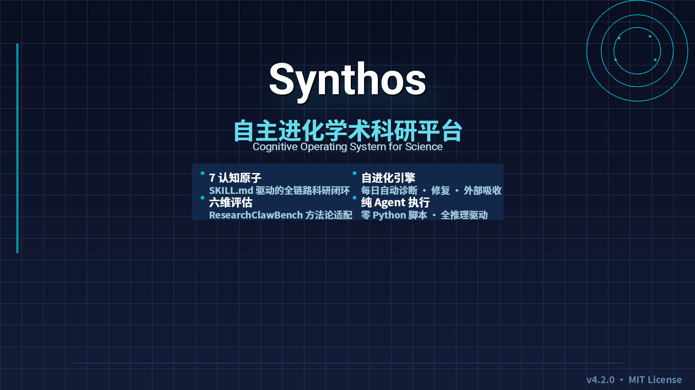

<p align="center">
  
</p>

<h1 align="center">Synthos — 自主进化学术科研平台</h1>

<p align="center">
  <em>A Computable, Collaborative, and Evolving Cognitive Operating System for Science</em>
</p>

<p align="center">
  <a href="#-philosophy">Philosophy</a> •
  <a href="#-architecture">Architecture</a> •
  <a href="#-cognitive-atoms">Atoms</a> •
  <a href="#-self-evolution">Evolution</a> •
  <a href="#-evaluation">Evaluation</a> •
  <a href="#-getting-started">Setup</a>
</p>

---

**Synthos** 是一个 **纯技能（SKILL.md）驱动** 的认知操作系统，用于科学研究。它将科研全流程分解为 **7 个认知原子**，每个原子由 Agent 原生执行的 SKILL.md 定义——不产生 Python 脚本，纯粹通过 Agent 的推理能力完成认知任务。

从文献检索到论文输出，Synthos 完整覆盖科研的认知闭环。配合 **自进化引擎**，系统每天自动检查健康状况、执行功能测试、从外部项目吸收养分，持续自我增强。

> **当前版本**: v4.2.0 · 进化引擎 v2.3 · 综合评分: 95/100

---

## 🧠 Philosophy

Synthos 基于 **八维认知框架** 构建：

| # | 维度 | 核心思想 | 覆盖原子 | 实现度 |
|:-:|------|---------|:--------:|:-----:|
| 1 | **第一性原理** | 从原始事实逐层构建 | 1,2,4,5 | 95% |
| 2 | **系统思维** | 整体视角理解知识关系 | 1,3,5 | 95% |
| 3 | **贝叶斯思维** | 基于证据更新信念 | 4,6 | 90% |
| 4 | **类比思维** | 跨领域知识迁移 | 4 | 80% |
| 5 | **奥卡姆剃刀** | 最短路径优先 | 0,2,5 | 80% |
| 6 | **证伪主义** | 主动寻找反证 | 6,1 | 80% |
| 7 | **模型依赖实在论** | 多视角、多源交叉验证 | 3 | 60% |
| 8 | **自由能原理** | 自我进化、最小化预测误差 | 6, meta | 55% |

**综合实现度**: 85%（基于内置审计框架）

核心原则：**宪法 → 架构 → Schema → 实现**，逐层定稿不回溯。每层产出形式化定义（非重叠性证明、I/O 契约、追溯矩阵）。

---

## 🏗️ Architecture

```
┌─────────────────────────────────────────────────────────┐
│                    用户输入 (User)                        │
│              Feishu / CLI / 自然语言查询                   │
└───────────────────────┬─────────────────────────────────┘
                        │
┌───────────────────────▼─────────────────────────────────┐
│              任务路由器 (Task Router · 原子0)              │
│          复杂度判断 + 最短原子链选择 + 任务路由             │
│          输出: atom_chain = [1,2,3,4,5,6] 或子集         │
└───────────────────────┬─────────────────────────────────┘
                        │
┌───────────────────────▼─────────────────────────────────┐
│                 认知原子层 (Cognitive Atoms)               │
│                                                           │
│  ┌────────────┐   ┌────────────┐   ┌────────────┐        │
│  │ 原子1      │ → │ 原子2      │ → │ 原子3      │        │
│  │ 知识获取   │   │ 知识提取   │   │ 关联发现   │        │
│  │ + 引用验证  │   │            │   │            │        │
│  └────────────┘   └────────────┘   └────────────┘        │
│       ↓                                                   │
│  ┌────────────┐   ┌────────────┐   ┌────────────┐        │
│  │ 原子4      │ → │ 原子5      │   │ 原子6      │        │
│  │ 观点生成   │   │ 论证表达   │ ←→│ 观点验证   │        │
│  │ + CRISP-DM │   │            │   │            │        │
│  └────────────┘   └────────────┘   └────────────┘        │
│                       ↕ (双向迭代)                         │
└───────────────────────┬─────────────────────────────────┘
                        │
┌───────────────────────▼─────────────────────────────────┐
│                 输出层 (Output Layer)                     │
│  ┌────────────────┐  ┌────────────────────┐             │
│  │ LaTeX 论文输出  │  │ 结构化 JSON 汇总   │             │
│  │ .tex + .bib    │  │ assembled_output   │             │
│  └────────────────┘  └────────────────────┘             │
└───────────────────────┬─────────────────────────────────┘
                        │
┌───────────────────────▼─────────────────────────────────┐
│              进化引擎 (Evolution Engine) v2.3             │
│                                                           │
│  每日06:00自动运行 · 9步循环 · 项目追踪DB · 自扩展关键词     │
│                                                           │
│  LOAD → LESSONS → PROBE → BENCHMARK → EXTERNAL           │
│    ↓        ↓         ↓         ↓          ↓             │
│  加载状态   导入教训   结构探测   功能测试   主动吸收        │
│                                                           │
│  DIAGNOSE → IMPROVE → VERIFY → RECORD                    │
│     ↓          ↓         ↓         ↓                     │
│  综合诊断    自动修复    验证     写报告+教训              │
└─────────────────────────────────────────────────────────┘
```

### 分层原则

- **核心层**（7 认知原子 + 路由器）—— 稳定，非用户批准不修改
- **扩展层**（外部吸收的技能）—— 动态，可增长
- **元层**（进化引擎）—— 自我优化，Agent 驱动

---

## ⚛️ Cognitive Atoms

每个原子是一个独立的 `SKILL.md`，Agent 直接加载执行。定义清晰的 I/O 契约、边界条件和金标准测试。

| # | 原子 | 职责 | 核心能力 | 上游 |
|:-:|------|------|---------|:----:|
| 0 | **Task Router** | 任务路由 | 复杂度判断 + 最短原子链选择 | — |
| 1 | **Knowledge Acquisition** | 文献检索 | S2/PubMed/OpenAlex 三源并行 + 4层引用验证 | 0 |
| 2 | **Knowledge Extraction** | 知识提取 | 方法论/发现/局限/主题结构化提取 | 1 |
| 3 | **Association Discovery** | 关联发现 | 矛盾/补充/演进识别 + 研究空白挖掘 | 2 |
| 4 | **Hypothesis Generation** | 假设生成 | 第一性原理/类比/贝叶斯推理 + CRISP-DM 模板 | 3 |
| 5 | **Argument Expression** | 论证写作 | IMRaD 结构论文生成 + APA 7th 引用 | 4 |
| 6 | **Viewpoint Verification** | 观点验证 | 反方论证 + 证伪条件 + 置信度评估 | 4,5 |

### 关键设计原则

- **非重叠性证明**: 每个原子的边界有形式化定义（`references/BOUNDARY.md`）
- **可复现性**: 金标准测试（`golden/`）确保同一输入 → 等价输出
- **I/O 契约**: `references/IO_CONTRACT.md` 精确定义输入输出 schema
- **证据追溯**: 每个输出可追溯到上游输入（`references/EVIDENCE_SCHEMA.md`）

---

## 🔄 Self-Evolution

进化引擎是 Synthos 的元层，每天 06:00 自动运行一个完整的 9 步循环：

| 步骤 | 名称 | 内容 |
|:----:|:----|:----|
| 1 | **LOAD** | 三级渐进式加载状态（元数据→详细→按需） |
| 2 | **LESSONS** | 从 lessons.jsonl 加载历史教训 |
| 3 | **PROBE** | 7 原子结构健康检查（文件存在/Schema/引用完整性） |
| 4 | **BENCHMARK** | API 功能测试 + Golden JSON 金标准验证（轮转） |
| 5 | **EXTERNAL** | 主动吸收引擎：项目追踪库随访 + 关键词扫描 + 自扩展 |
| 6 | **DIAGNOSE** | 综合评分（结构×0.30+基准×0.40+技能树×0.20+吸收×0.10） |
| 7 | **IMPROVE** | 自动修复结构问题 + 生成吸收提议 |
| 8 | **VERIFY** | 验证修复效果 |
| 9 | **RECORD** | 写报告 + evolution-latest.json + 提取教训 |

### 外部吸收引擎

进化引擎每轮执行主动扫描，而不是每 7 轮一次：

- **项目追踪数据库** — `absorption-tracked.json` 记录所有发现的项目、评分、状态
- **关键词自我扩展** — 从项目 topics/description 自动提取新关键词（10 → 73 个）
- **自检关键词** — 从 PROBE/DIAGNOSE 结果发现新搜索方向
- **8 个搜索类别轮转** — research_agent / architecture / literature / knowledge / reasoning / pipeline / evaluation / self_discovered

**当前追踪**: 20 个项目 · 已吸收 3 项技能 · 3 个待评估

---

## 📊 Evaluation Framework

基于 **ResearchClawBench** 方法论适配的 6 维评估标准：

| 维度 | 权重 | 检项 | 当前分 |
|:----|:----:|:----|:-----:|
| D1 知识获取 | 15% | 文献覆盖面、多源覆盖、相关性 | 94 |
| D2 知识提取 | 15% | 字段完整性、方法论分类、证据等级 | 86 |
| D3 关联发现 | 20% | 类型多样性、矛盾识别、研究空白 | 86 |
| **D4 假设生成** | **20%** | **新颖性、可检验性、CRISP-DM** | **85** |
| D5 论证表达 | 15% | IMRaD结构、证据支撑、引用格式 | 70 |
| D6 观点验证 | 15% | 反方观点、证伪条件、置信度诚实 | 90 |

**总分**: 95/100（卓越） · 评分哲学: 50=复现论文, 70=超越基线, 85+=卓越

---

## 📁 Project Structure

```
Synthos/
├── skills/                          # 核心技能（9 个 SKILL.md）
│   ├── task-router/                 # 原子0: 任务路由
│   ├── knowledge-acquisition/       # 原子1: 知识获取 + 引用验证
│   ├── knowledge-extraction/        # 原子2: 知识提取
│   ├── association-discovery/       # 原子3: 关联发现
│   ├── hypothesis-generation/       # 原子4: 假设生成 + CRISP-DM
│   ├── argument-expression/         # 原子5: 论证表达
│   ├── viewpoint-verification/      # 原子6: 观点验证
│   ├── evolution/                   # 进化引擎 v2.3
│   │   ├── SKILL.md
│   │   └── references/              # BENCHMARKS, LESSONS, ABSORPTION...
│   └── latex-output/                # LaTeX 论文输出
│
├── docs/                            # 文档
│   ├── synthos-philosophy.md        # 八维认知框架
│   ├── synthos-evaluation-framework.md  # 评估标准
│   ├── atom-io-schemas.md           # I/O 契约总表
│   └── ... (审计报告、技术路线图等)
│
├── README.md
├── LICENSE (MIT)
└── .gitignore
```

---

## 🚀 Getting Started

### 环境要求

- **运行环境**: [Hermes Agent](https://hermes-agent.nousresearch.com) — Agent 原生执行平台
- **API Keys**（环境变量）:
  - `SEMANTIC_SCHOLAR_API_KEY` — Semantic Scholar API
  - `PUBMED_API_KEY` — PubMed API (可选)
  - `OPENALEX_API_KEY` — OpenAlex API (可选)
- **系统**: Linux / macOS / WSL

### 快速开始

```bash
# 1. 克隆仓库
git clone https://github.com/yakeworld/Synthos.git
cd Synthos

# 2. 设置 API 密钥
export SEMANTIC_SCHOLAR_API_KEY="your_key_here"

# 3. 设置 Hermes Agent
#    确保 ~/.hermes/config.yaml 中配置了 skills 路径

# 4. 运行一个完整科研任务
#    通过 Hermes 输入查询：
#    "搜索 ADHD 眼动追踪的最新文献，提取关键发现，
#     分析关联与空白，生成研究假设，写出论文章节"
```

### 运行完整链路

查询复杂度决定自动选择的原子链：

| 查询类型 | 触发词示例 | 原子链 |
|---------|-----------|:------:|
| 简单搜索 | "找关于 XX 的论文" | [1] |
| 中等分析 | "分析 XX 领域的研究现状" | [1,2,3] |
| 复杂写作 | "写一篇 XX 综述" | [1,2,3,4,5] |
| 完整流程 | "从搜索到验证，完整分析 XX" | [1,2,3,4,5,6] |

### 进化引擎

```bash
# 手动触发进化循环
hermes cron run synthos-evolution

# 查看上次进化结果
cat outputs/evolution/evolution-latest.json

# 查看项目追踪库
cat outputs/evolution/absorption-tracked.json
```

---

## 📝 License

[MIT License](LICENSE) — 详见 [LICENSE](LICENSE) 文件。

Copyright (c) 2026 Yang Xiaokai (杨晓凯)

---

## 📚 References

- **ResearchClawBench**: [InternScience/ResearchClawBench](https://github.com/InternScience/ResearchClawBench) — 评估方法论来源
- **KILO-KIT**: [VoDaiLocz/KILO-KIT](https://github.com/VoDaiLocz/KILO-KIT) — CBU 模式吸收来源
- **AutoResearchClaw**: [AutoResearchClaw](https://github.com/AutoResearchClaw/AutoResearchClaw) — 引用验证 + LaTeX 输出吸收来源
- **Hermes Agent**: [Hermes Agent](https://hermes-agent.nousresearch.com) — Agent 执行平台

---

<p align="center">
  <sub>Built with ❤️ for open science. 从文献到见解，从数据到知识。</sub>
</p>
