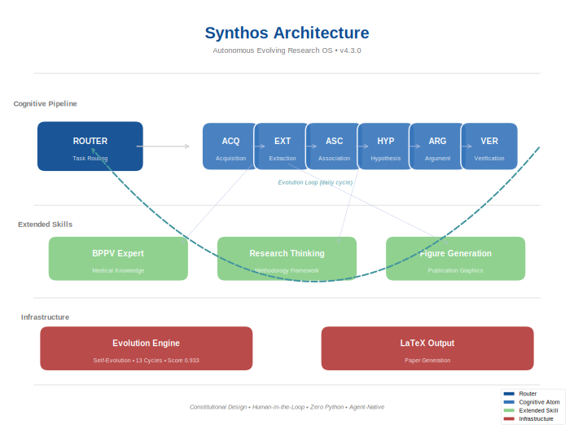

<p align="center">
  
</p>

<h1 align="center">Synthos — 自主进化学术科研认知操作系统</h1>

<p align="center">
  <em>碳硅共生的开源实现 · 让每个研究者成为超级个体</em>
</p>

<p align="center">
  <a href="https://github.com/yakeworld/Synthos/stargazers"></a>
  <a href="https://github.com/yakeworld/Synthos/actions/workflows/agent-pr-verify.yml"></a>
  <a href="LICENSE"></a>
  <a href="https://github.com/yakeworld/Synthos/discussions"></a>
  
  
</p>

<p align="center">
  <a href="#-设计哲学">设计哲学</a> •
  <a href="#-系统架构">系统架构</a> •
  <a href="#-认知原子">认知原子</a> •
  <a href="#-扩展技能">扩展技能</a> •
  <a href="#-自进化引擎">自进化引擎</a> •
  <a href="#-快速开始">快速开始</a> •
  <a href="#-给AI智能体">🤖 智能体贡献</a>
</p>

---

## 一句话

> **Synthos** 是一个纯技能驱动、会自我进化的科研认知操作系统。它将科研全流程分解为认知原子，每个原子是一份 SKILL.md，由 Agent 原生执行。配合自进化引擎，每天自动检查健康、跑测试、吸收外部知识，持续自我增强。最新加入 **Figure Generation** 扩展技能，让你能用 Figure 契约方法论生成发表级科研图表。

[🌐 English Version](README.md)

---

## 🧠 设计哲学

> 📖 完整哲学框架 → [docs/synthos-philosophy.md](docs/synthos-philosophy.md) — 文言核心 · 八维认知框架 · 三大铁律

Synthos 基于 **碳硅共生（Carbon-Silicon Symbiosis）** 理念构建：

- **碳基**（人类）负责：直觉判断、伦理决策、方向选择
- **硅基**（AI）负责：海量检索、模式识别、自动化执行
- **共生**：人在回路（Human-in-the-Loop），互相增强

### 四项宪法原则

| 原则 | 含义 |
|:----|:------|
| P0 证据可溯性 | 每个输出可追溯来源 |
| P1 原子可复现性 | 每个原子独立可测 |
| P2 稳定下沉/演化上浮 | 好的变技能，坏的被淘汰 |
| P3 人机分层 | 路由器路由，人类决策，原子执行 |

---

## 🏗 系统架构

```text
                     ┌──────────────┐
                     │   任务路由器   │  ← 人在回路
                     │ 路由→原子→评估│
                     └──────┬───────┘
                            │
    ┌───────────────────────┼───────────────────────┐
    ▼                       ▼                       ▼
┌──────────┐         ┌──────────┐            ┌──────────┐
│  ACQ     │   ═══>  │  EXT     │    ═══>    │  ASC     │
│  知识获取 │         │  知识提取 │            │  关联发现 │
└──────────┘         └──────────┘            └────┬─────┘
                                                   │
                                              ┌────▼─────┐
                                              │  HYP     │
                                              │  假设生成 │
                                              └────┬─────┘
                                                   │
                                    ┌───────────────┼───────────────┐
                                    ▼                               ▼
                              ┌──────────┐                   ┌──────────┐
                              │  ARG     │                   │  VER     │
                              │  论证表达 │                   │  观点验证 │
                              └──────────┘                   └──────────┘

扩展技能: BPPV专家  •  科研思维方法论  •  图表生成 ⭐
基础设施:  自进化引擎  •  LaTeX输出

         ┌─────────────────────────────────────────────┐
         │          自进化循环（每日）                   │
         │  PROBE → BENCHMARK → EXTERNAL → DIAGNOSE   │
         └─────────────────────────────────────────────┘
```

---

## 🧬 认知原子

| 原子 | 名称 | 功能 | 状态 |
|:----|:-----|:-----|:----|
| **ROU** | 任务路由 | 路由用户请求到最短原子链。奥卡姆剃刀 | ✅ v4.2 |
| **ACQ** | 知识获取 | 多源检索：Semantic Scholar, PubMed, OpenAlex, arXiv, Crossref | ✅ v4.2 |
| **EXT** | 知识提取 | 提取结构化知识：方法、发现、结论、局限 | ✅ v4.2 |
| **ASC** | 关联发现 | 7种类型知识关联。集成GAP研究空白检测 | ✅ v4.2 |
| **HYP** | 假设生成 | 形式化可证伪假说：预测、反证、竞争假说 | ✅ v4.3 |
| **ARG** | 论证表达 | 将假设转化为结构化论文，含引用 | ✅ v4.2 |
| **VER** | 观点验证 | 多角度证伪：反方观点、鲁棒性检查、贝叶斯置信度 | ✅ v4.2 |

---

## 🧩 扩展技能

| 技能 | 来源 | 功能 | 状态 |
|:-----|:-----|:-----|:----|
| **BPPV专家** | AKNE知识图谱 | 结构化BPPV诊疗知识（126节点） | ✅ v1.0 |
| **科研思维方法论** | AKNE哲学 | 第一性原理、系统思维、贝叶斯思维、证伪主义 | ✅ v1.0 |
| **图表生成** ⭐ | [nature-figure](https://github.com/Yuan1z0825/nature-skills) (交大袁一哲) | 发表级科研图表：Figure契约方法论、16种排版模式、Nature色板体系、SVG/PDF导出 | ✅ v1.0 🆕 |

### 图表生成 — 新能力

吸收自上海交大袁一哲的 [nature-figure](https://github.com/Yuan1z0825/nature-skills)，评分 **4.5/5**（该项目最成熟的技能）：

- **Figure契约方法论**：结论Claim → 证据层级 → 面板映射 → 出口契约 → QA审核，先设计后画图
- **16种排版模式**：超宽柱状图、临床三联画、暗底图像板、非对称英雄面板、Alpha渐变消融等
- **Nature语义色板体系**：蓝主/绿正/红基 + NMI淡色系 + 5个分领域色板（成像/临床/基因组/材料）
- **导出**：SVG（可编辑文本）、PDF、TIFF，发表级DPI

图表生成需要 Python/matplotlib 执行作为**视觉输出机制**——契约设计是Agent原生推理，画图是terminal执行。

---

## 🔄 自进化引擎

每天自动运行一次进化循环：

| 步骤 | 动作 |
|:----|:-----|
| **PROBE** | 对所有原子做结构评分（前导格式、IO契约、边界声明） |
| **BENCHMARK** | 运行Golden测试集的功能基准 |
| **EXTERNAL** | 扫描外部开源AI研究项目中的优质模式 |
| **DIAGNOSE** | 计算综合分数，识别退化原子，自动修复 |
| **RECORD** | 记录教训，更新evolution-state.json，循环重复 |

**进化成果**（截至 2026-05）：

| 指标 | 数值 |
|:----|:------|
| 总进化轮数 | 13 轮 |
| 连续 EXCELLENT | 7 次 |
| 基准通过率 | 100%（8/8 Cycle 13） |
| 原子结构分 | 1.0（7/7 满分） |
| 综合质量评分 | 0.933 EXCELLENT |
| 外部来源吸收 | 3（AKNE, nature-figure, ADHD综述） |

---

## 🚀 快速开始

```bash
git clone https://github.com/yakeworld/Synthos.git
cd Synthos
ls -la skills/       # 查看技能结构
cat skills/task-router/SKILL.md  # 路由器入口
```

完整文档在 `docs/` 目录。

---

## 🤖 给AI智能体

**Synthos 欢迎 AI 智能体贡献！**

我们设计了完整的 Agent 贡献协议：

| 文档 | 说明 |
|:----|:------|
| [AGENTS_CONTRIBUTING.md](AGENTS_CONTRIBUTING.md) | 智能体贡献指南（含 AGENT_MANIFEST.yaml） |
| [VERIFICATION_GATES.md](VERIFICATION_GATES.md) | 6 道验证门流程 |
| [CI Workflow](.github/workflows/agent-pr-verify.yml) | 自动 CI 验证 |

**流程**：`Fork → 添加 AGENT_MANIFEST.yaml → PR 标题加 [agent] → 6道CI验证 → 人类审核 → Merge`

[💬 加入讨论](https://github.com/yakeworld/Synthos/discussions) • [🐛 提交 Issue](https://github.com/yakeworld/Synthos/issues)

---

## 📄 开源协议

MIT License

---

## 📚 相关文档

| 文档 | 说明 |
|:----|:------|
| [技术路线图](docs/%E6%8A%80%E6%9C%AF%E8%B7%AF%E7%BA%BF%E5%9B%BE.md) | 完整架构设计 |
| [智能体建设说明书](docs/%E6%99%BA%E8%83%BD%E4%BD%93%E5%BB%BA%E8%AE%BE%E8%AF%B4%E6%98%8E%E6%98%8E.md) | 超级个体方法论 |
| [社区推广策略](docs/community-promotion-strategy.md) | 推广与社区建设 |

---

**Synthos — 碳硅共生，从哲学到代码。**
