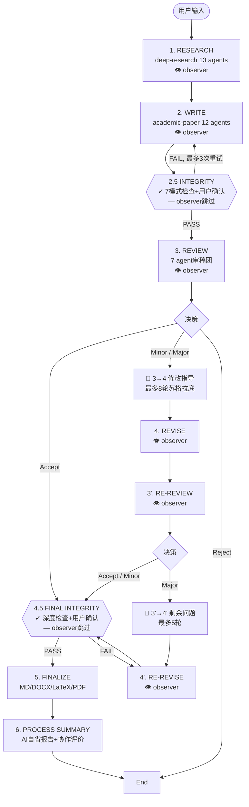

# ARS (Academic Research Skills) → Synthos 深度吸收报告

> 生成日期：2026-05-13 | 版本：v3.7.0 → Synthos v4.3.1
> 目标：将 ARS 的 32-Agent 科研流水线架构精粹吸收到 Synthos 7-原子认知OS中

---

## 目录

1. [ARS 全景架构](#1-ars-全景架构)
2. [10阶段流水线拆解](#2-10阶段流水线拆解)
3. [核心机制深度分析](#3-核心机制深度分析)
   - 3.1 反谄媚 / Concession Threshold Protocol
   - 3.2 完整性门控 / Integrity Gates
   - 3.3 引用幻觉分类法 / Citation Hallucination Taxonomy
   - 3.4 意图检测层 / Intent Detection Layer
   - 3.5 对话健康指标 / Dialogue Health Indicator
   - 3.6 Material Passport & 数据溯源
   - 3.7 数据访问级别 / Data Access Levels
   - 3.8 Sprint Contract / 履约合约
   - 3.9 Generator-Evaluator 合约 (v3.6.8)
   - 3.10 协作深度观察 / Collaboration Depth Observer
   - 3.11 风格校准 / Style Calibration
   - 3.12 跨模型验证 / Cross-Model Verification
4. [Schema 体系](#4-schema-体系)
5. [与 Synthos 的深度对比](#5-与-synthos-的深度对比)
6. [吸收优先级矩阵](#6-吸收优先级矩阵)
7. [具体吸收方案](#7-具体吸收方案)
   - 7.1 立即吸收（Phase 1）
   - 7.2 近期整合（Phase 2）
   - 7.3 中期参考（Phase 3）
8. [反模式清单（避免重蹈覆辙）](#8-反模式清单)

---

## 1. ARS 全景架构

### 1.1 基本数据

| 指标 | 值 |
|------|-----|
| 仓库 | Imbad0202/academic-research-skills |
| Stars | 6,358 |
| 发布时间 | 2026-02-26 |
| 当前版本 | v3.7.0（2026-05-05） |
| 迭代节奏 | 3个月 13个大版本（v1.0 → v3.7.0） |
| 许可 | CC BY-NC 4.0 |
| 作者 | Cheng-I Wu（吴政宜）— 独立开发者 |
| 生态 | Claude Code 插件（也支持 Codex CLI 分发） |

### 1.2 四模块结构

```
academic-research-skills/
├── deep-research/              # 13 Agent | 调研模块
│   ├── SKILL.md (核心技能描述)
│   ├── agents/                 # 13个Agent prompt文件
│   ├── references/             # 规则/模式/协议参考
│   └── templates/              # 模板文件
├── academic-paper/             # 12 Agent | 写作模块
├── academic-paper-reviewer/    # 7 Agent | 审稿模块
├── academic-pipeline/          # 4 Agent | 10阶段流水线编排器
├── shared/                     # 共享的Schema/协议/模式
│   ├── handoff_schemas.md      # 13个Schema（核心数据合约）
│   ├── contracts/              # Sprint Contract模板
│   ├── sprint_contract.schema.json
│   └── 各种pattern文档
├── .claude-plugin/             # Claude Code 插件打包
├── docs/                       # ARCHITECTURE.md, SETUP.md, PERFORMANCE.md
├── scripts/                    # 33个CI lint脚本
└── tests/                      # 71+ 单元测试
```

### 1.3 核心哲学

> **"AI is your copilot, not the pilot. This tool won't write your paper for you."**

- AI处理苦力活（找文献、核对引用、检查数据一致性）
- 人定义问题、选择方法、解读数据、写"我论证"那句话
- 不帮隐藏AI使用痕迹，反而提供合规的AI披露声明
- 核心不是"替代人类"，而是"让人类能做更高层次的思考"

这与Synthos的**碳硅共生**哲学完全一致。

---

## 2. 10阶段流水线拆解

### 2.1 阶段流程



### 2.2 阶段详情

| 阶段 | 技能/模式 | 数据级别 | Agent数 | 核心产出 | 门控类型 |
|------|-----------|---------|---------|---------|---------|
| 1. RESEARCH | deep-research (7种模式) | RAW | 13 | RQ Brief + 方法论蓝图 + 注释文献表 | 🧑 人类决策 |
| 2. WRITE | academic-paper (10种模式) | REDACTED | 12 | 论文全稿 | 🧑 人类决策 |
| 2.5 INTEGRITY | integrity_verification_agent | VERIFIED_ONLY | 2 | 完整性报告 + 修正后论文 | ✓ 强制门控 |
| 3. REVIEW | academic-paper-reviewer (6种模式) | VERIFIED_ONLY | 7 | 5份审稿报告 + 编辑决定 | 🧑 人类决策 |
| 3→4 修改指导 | EIC苏格拉底子阶段 | — | 1 | 修改策略对话 | 🧑 人类决策 |
| 4. REVISE | academic-paper (revision) | REDACTED | 2 | 逐点回复 + 修订稿 | 🧑 人类决策 |
| 3'. RE-REVIEW | academic-paper-reviewer (re-review) | VERIFIED_ONLY | 3 | 验证报告 + R&R追溯矩阵 | 🧑 人类决策 |
| 4'. RE-REVISE | academic-paper (revision) | REDACTED | 2 | 最终修订稿 | 🧑 人类决策 |
| 4.5 FINAL INTEGRITY | integrity_verification_agent | VERIFIED_ONLY | 2 | 最终完整性报告 | ✓ 强制门控（零容忍） |
| 5. FINALIZE | academic-paper (format-convert) | VERIFIED_ONLY | 1 | 出版就绪文件 | 🧑 人类决策 |
| 6. PROCESS SUMMARY | pipeline自动 | VERIFIED_ONLY | 3 | 论文创建过程 + 协作评价 | 🧑 人类决策 |

### 2.3 门控类型

| 门控 | 符号 | 含义 | 示例 |
|------|------|------|------|
| 🧑 决策重门控 | 红色实线 | 用户选择分支或批准重大决定 | 接受/小修/大修/拒稿 |
| ✓ 完整性门控 | 橙色实线 | 机器验证+用户确认，不可跳过 | Stage 2.5/4.5 |
| 🟢 辅导子阶段 | 绿色 | 苏格拉底式对话，用户可跳过 | 修改指导、剩余问题 |
| 👁 协作观察 | 观察者 | 仅建议，从不阻塞 | collaboration_depth_agent |
| 🤖 纯机器 | 自动 | CI lint、API验证 | S2 API验证、反泄漏检查 |

---

## 3. 核心机制深度分析

### 3.1 反谄媚 / Concession Threshold Protocol

**位置**: deep-research/agents/devils_advocate_agent.md + academic-paper-reviewer/agents/devils_advocate_reviewer_agent.md

**问题**: LLM在辩论中被反驳时倾向于过快认输，因为训练数据奖励"对话和谐"。

**方案 — 三步骤协议**:

**Step 1: 对反驳打分（1-5）**

| 分数 | 定义 | 动作 |
|------|------|------|
| 5 | 直接针对核心攻击 + 新证据/严密逻辑 | **让步** |
| 4 | 实质削弱攻击，有小缺口 | **让步但标注缺口** |
| 3 | 部分相关但偏离核心 | **坚守** — 重申原攻击 |
| 2 | 边缘相关 | **反攻** — 指出偏离 |
| 1 | 断言无证据/权威诉求 | **升级** — 加强原攻击 |

**Step 2: 记录每次决策** — 内部标签 `[DA-DECISION: Score X/5 | ACTION: ...]`

**Step 3: 反谄媚规则**:
- ❌ **不因用户坚持而让步** — 坚持不是证据
- ❌ **不准连续让步** — 让步后下次门槛升到5/5
- ❌ **让步率 > 50% → 暂停并提升所有门槛到5/5**
- ✅ **思维框锁检测** — 每轮检查后问："这个讨论的前提假设是什么我还没质疑？"

**审稿DA的不同**: 用"撤回/降级/维持/重申/加强"代替"让步/坚守/反攻/升级"。

**→ Synthos应用**: 进化引擎中的辩论机制、reviewer原子、quality gate原子都可以直接嵌入此协议。

### 3.2 完整性门控 / Integrity Gates

**位置**: academic-pipeline/agents/integrity_verification_agent.md

**两阶段模式**:

**模式1 (Stage 2.5 — 预审查)**:
- Phase A: 100%参考文献存在性 + 书目准确性（S2 API批处理 + WebSearch）
- Phase B: ≥30%引用上下文抽查
- Phase C: 100%统计数据验证 + 内部一致性
- Phase D: ≥30%独创性抽查（WebSearch段级 + 自我抄袭）
- Phase E: 30%声明验证（最少10个）

**模式2 (Stage 4.5 — 最终检查)**:
- Phase A: 所有参考文献**全新全量验证**（仿佛Stage 2.5没发生过）
- Phase B: 100%引用上下文（非抽查）
- Phase C: 100%数据
- Phase D: ≥50%独创性；新/修改段落100%
- Phase E: 100%声明验证（零MAJOR_DISTORTION + 零UNVERIFIABLE）

**通过条件**: 零SERIOUS + 零MEDIUM + 零MAJOR_DISTORTION + 零UNVERIFIABLE

**反幻觉训令**: 永远不依赖AI记忆 — 每条参考文献必须WebSearch。"难以验证"不是有效判决。

**→ Synthos应用**: 每个原子的输出门控 + 进化引擎的知识验证节点。

### 3.3 引用幻觉分类法 / Citation Hallucination Taxonomy

**来源**: GPTZero × NeurIPS 2025 (Adams et al., 2026)

| 类型 | 编码 | 频率 | 描述 | 检测策略 |
|------|------|------|------|---------|
| **完全编造** | TF | 28% | 整篇论文不存在，标题作者期刊全假 | WebSearch标题+作者 |
| **假作者/会议** | PAC | 23% | 真实学者被归到没写过的论文 | 查Google Scholar真实发文列表 |
| **不完整幻觉** | IH | 19% | 缺少可验证细节（无DOI、模糊页码） | 无DOI+卷+页码的标记深查 |
| **部分幻觉** | PH | 18% | 不同来源的实元素混搭 | 所有元数据对单个来源交叉验证 |
| **微妙幻觉** | SH | 12% | 小扭曲（错年份、扩写缩写、换期刊） | 逐字段对比出版商页面 |

**复合欺骗模式**（76%的TF案例）:
1. **作者伪装** (PAC+TF): 编造的论文归到真实活跃研究者名下
2. **期刊利用** (PH+PAC): 真实期刊名 + 假文章细节
3. **混合编造** (PH): 2-3篇真实论文混合成一篇假论文
4. **时间掩饰** (SH): 正确作者+话题 + 错误年份
5. **DOI误导**: 假DOI指向真实但不相关的论文（64%的假DOI案例）

**→ Synthos应用**: 可作为source verification atom的检测模板。

### 3.4 意图检测层 / Intent Detection Layer

**位置**: deep-research/agents/socratic_mentor_agent.md

**目的**: 区分用户是"探索"还是"目标驱动" → 防止探索模式下过早收敛。

**检测信号**:

| 信号 | 探索模式 | 目标模式 |
|------|---------|---------|
| 提到截止日期/交付物 | ❌ | ✅ |
| 问开放式思辨问题 | ✅ | ❌ |
| 反驳导师框架 | ✅ | ❌ |
| 说"继续探索"/"我还不确定" | ✅ | ❌ |
| 说"帮我规划"/"我需要写" | ❌ | ✅ |

**行为差异**:

| 行为 | 探索模式 | 目标模式 |
|------|---------|---------|
| 自动收敛 | **禁用** | 启用 |
| 停滞检测 | 15轮（从10轮提高） | 10轮 |
| 最大轮数 | 60 | 40 |
| "要我总结吗？" | **永不主动发起** | 标准 |
| 挑战频率 | 高 (40%+) | 标准平衡 |

**→ Synthos应用**: 路由器原子的"意图识别"环节，决定使用哪种认知模式。

### 3.5 对话健康指标 / Dialogue Health Indicator

**位置**: deep-research/agents/socratic_mentor_agent.md

**每5轮无声自检**:

| 维度 | 警告信号 | 触发条件 | 自动干预 |
|------|---------|---------|---------|
| **持续同意** | 近5轮有4+轮同意无反驳 | 计数同意vs挑战 | 注入一个有挑战的问题 |
| **冲突回避** | 用户不适后弱化了追问 | 追踪追问强度变化 | 从新角度重述原问题 |
| **过早收敛** | 在用户准备好转向前建议总结 | 追踪收敛建议次数 | 撤回建议，提更深问题 |

**→ Synthos应用**: 可嵌入所有原子作为meta-cognition层，检测对话质量退化。

### 3.6 Material Passport & 数据溯源

**位置**: shared/handoff_schemas.md Schema 9

**结构**:
```
Material Passport (Schema 9)
├── 核心溯源: origin_skill, origin_mode, origin_date, verification_status, version_label, content_hash
├── literature_corpus[] (v3.6.4): 用户策展文献库
│   └── CSL-JSON格式, 适配Zotero/Obsidian/PDF文件夹
├── reset_boundary[] (v3.6.3): append-only检查点/恢复日志
│   └── kind: boundary / kind: resume
├── compliance_history[] (v3.4.0): 合规报告轨迹
├── audit_artifact[] (v3.6.7): 跨模型审计结果
├── repro_lock (v3.3.5): 配置锁文件（随机性声明、模型信息、prompt哈希）
└── style_profile: 写作风格配置
```

**流经阶段**: 每个产出附带Material Passport → 阶段转换时验证 → 中途入口检查freshness (<24h) → 跨会话通过passport重建会话。

**四条铁律**（文献消费者v3.6.5）:
1. **相同标准**: 对语料库和外部数据库应用相同的纳入/排除标准
2. **不静默跳过**: 跳过的语料必须记录原因
3. **不修改语料**: 消费者只读，不修改/回填/派生
4. **优雅降级**: 解析失败时回退到外部数据库流程

**→ Synthos应用**: 这是整个吸收中最直接可用的部分。Synthos的knowledge provenance tracing机制可以完全采用Material Passport模式。

### 3.7 数据访问级别 / Data Access Levels

**三层模型**:

| 级别 | 层 | 含义 | 应用 |
|------|-----|------|------|
| `raw` | Layer 1 | 消费未验证源，假设对抗性/幻觉输入 | deep-research |
| `redacted` | Boundary | 在脱敏材料上操作 | academic-paper |
| `verified_only` | Layer 2 | 仅在上游完整性门控后运行 | reviewer, pipeline |

**Layer 3**（真值/评分标准）是关键的防火墙 — 永远不与Layer 1/Layer 2的输出生成共存于同一上下文窗口。

**设计原理**: 防止奖励黑客/评分标准优化。完整性门控是实际执行点。

**→ Synthos应用**: 可映射到Synthos的信息安全层，为不同原子设置不同的数据访问级别。

### 3.8 Sprint Contract / 履约合约

**位置**: shared/sprint_contract.schema.json (Schema 13/13.1)

**核心思想**: 审稿人在看到论文之前**必须先提交评分计划**。

**Schema 13.1 结构**:
- `contract_id`: 唯一标识符
- `mode`: 7种模式之一（reviewer/writer/evaluator各变体）
- `acceptance_dimensions[]`: 评审维度（D1-D7）
- `failure_conditions[]`: 失败条件（F0-F4，每个有severity 0-100）
- `measurement_procedure`: （审稿模式）先纸面盲注+评分计划再看文
- `pre_commitment_artifacts`: （写作模式）先提交接受标准摘要
- `disagreement_handling`: （评估模式）分歧处理协议
- `override_ladder`: 可选的三轮升级协议

**两阶段门控**:
1. Phase 1（paper-blind）: 审稿人提交合约（评分计划、接受标准）
2. Phase 2（paper-visible）: 按合约执行评分

**四份模板**:
- `reviewer/full.json`: Panel 5, 5维度, 4失败条件
- `reviewer/methodology_focus.json`: Panel 2, 2维度, 3失败条件
- `writer/full.json`: 7维度, 5失败条件
- `evaluator/full.json`: 5维度, 7失败条件

**→ Synthos应用**: 任务路由原子的"任务契约"模式 — 子任务分派前先建立合约，防止任务执行者修改标准。

### 3.9 Generator-Evaluator 合约 (v3.6.8)

扩展Sprint Contract到写作和评估流程：

**写作Agent流程**:
- Phase 4a: writer paper-blind pre-commitment（先承诺）
- Phase 4b: writer paper-visible drafting + self-scoring（再执行）

**评估Agent流程**:
- Phase 6a: evaluator paper-blind pre-commitment（先承诺）
- Phase 6b: evaluator paper-visible scoring + decision（再评分）

**设计目的**: 防止概念漂移 — Agent在看到完整输出后改变评分标准。

**→ Synthos应用**: 直接对应Synthos的"生成原子 + 验证原子"编排模式。

### 3.10 协作深度观察 / Collaboration Depth Observer

**位置**: academic-pipeline/agents/collaboration_depth_agent.md
**理论**: Wang & Zhang (2026), IJETHE 23:11

**四维评分**（0-10 per dimension）:

| 维度 | 含义 | 低分 | 高分 |
|------|------|------|------|
| **委托深度** | 一次性整任务 vs 零散微指令 | 一个个小指令 | 整块任务委托 |
| **认知警觉** | 批判性评估、验证、反馈 | 全盘接受 | 质疑、验证、修正 |
| **认知再分配** | 释放的认知能力投入更高层次 | 省力不做 | 省力后做更高阶的事 |
| **区域分类** | Zone 1(浅)/Zone 2(中)/Zone 3(深) | 机械执行 | 协同创造 |

**反谄媚规则**: 分数≥7必须给出具体对话引用；Zone 3触发重审；分数>24/30默认可疑。

**保证不阻塞**: observer输出从不出现"阻断"字段，`blocked_by: collaboration_depth_agent`是非法状态。frontmatter带 `blocking: false`。

**→ Synthos应用**: 完美嵌入evolution engine的meta-cognition层，衡量碳硅协作质量。

### 3.11 风格校准 / Style Calibration

**位置**: academic-paper/agents/intake_agent.md (Step 10)

**流程**: 投喂3+篇旧作 → 6维分析 → 生成Style Profile (Schema 10) → 由Material Passport携带

**六维分析**:
1. 句子长度分布
2. 段落长度分布
3. 词汇偏好（缓和语/过渡语/报告动词）
4. 引用整合风格（叙述vs括号比例）
5. 修饰语风格
6. 不同部分的语域转换

**优先级系统**:
1. **HARD**: 学科规范（不能违反）
2. **STRONG**: 目标期刊规范（如果指定）
3. **SOFT**: 个人风格（无冲突时应用）

**→ Synthos应用**: 对AKNE的"个人写作风格向量"设计有直接参考价值。

### 3.12 跨模型验证 / Cross-Model Verification

**状态**: 可选（由 `ARS_CROSS_MODEL` 环境变量激活）

| 场景 | 机制 |
|------|------|
| 完整性门控 | 30%参考文献盲送给第二模型，分歧标记为 `[CROSS-MODEL-DISAGREEMENT]` |
| 魔鬼代言人 | 独立生成批评，新发现添加为 `[CROSS-MODEL-FINDING]` |
| 同行评审 | 计划中：跨模型作为第6独立审稿人 |

**优雅降级**: API错误从不阻塞流水线 — 回退到单模型并标注。

**成本**: ~$0.60-1.10/全流水线。

**→ Synthos应用**: Synthos本身是模型无关的，可以天然支持"多模型交叉验证"。

---

## 4. Schema 体系

| Schema | 名称 | 生产者→消费者 | 用途 |
|--------|------|-------------|------|
| 1 | RQ Brief | deep-research → academic-paper | 研究问题、FINER分数、方法类型 |
| 2 | Bibliography | bibliography_agent → synthesis | 来源、DOI、证据级别、相关度 |
| 3 | Synthesis Report | synthesis_agent → paper | 主题、缺口、关键辩论 |
| 4 | Paper Draft | draft_writer_agent → reviewer | 完整手稿 |
| 5 | Integrity Report | integrity_verification_agent → pipeline | PASS/FAIL、5阶段审计 |
| 6 | Review Report | editorial_synthesizer_agent → pipeline | 编辑决定+审稿报告 |
| 7 | Revision Roadmap | reviewer → revision | 优先修订项+验证标准 |
| 8 | Response to Reviewers | revision → re-review | 逐项回复+解决状态 |
| 9 | **Material Passport** | 跨阶段元数据 | 溯源+文献语料+重置账本 |
| 10 | Style Profile | intake_agent → draft_writer | 6维写作风格 |
| 11 | R&R Traceability | re-review | 审稿关注点→作者主张→验证 |
| 12 | Compliance Report | compliance_agent | PRISMA+RAISE合规 |
| 13 | Sprint Contract | (合约Schema) | generator-evaluator合约 |

---

## 5. 与 Synthos 的深度对比

### 5.1 相同点

| 维度 | ARS | Synthos |
|------|-----|---------|
| **架构形式** | skill-based + SKILL.md | skill-based + SKILL.md |
| **人机协奏** | "AI copilot, not pilot" | "碳硅共生" |
| **模块化** | 4技能 × 32 Agent | 7原子 + 路由器 + 进化引擎 |
| **质量门控** | 完整性门控(不可跳过) | 输入/输出门控 |
| **数据溯源** | Material Passport | knowledge provenance |
| **版本追踪** | suite版本 + 逐模块版本 | evolution-state.json |
| **元认知** | collaboration_depth_observer | meta-cognition层 |
| **引用验证** | S2 API | source verification atom |
| **许可** | CC BY-NC 4.0 | MIT |

### 5.2 不同点

| 维度 | ARS | Synthos | 优劣 |
|------|-----|---------|------|
| **目标** | 科研论文写作流水线 | 通用知识库自进化OS | Synthos更通用 |
| **流程形式** | 10阶段线性流水线 | 7原子非线性进化 | ARS适合论文，Synthos适合知识管理 |
| **Agent数** | 32（固定） | 7原子（可扩展） | Synthos更轻量 |
| **模型绑定** | Claude Code专有 | 模型无关 | Synthos更灵活 |
| **进化能力** | 手动版本发布 | 自动进化引擎 | Synthos更先进 |
| **知识图谱** | 无 | 有（Neo4j向量+图） | Synthos更强大 |
| **Obsidian集成** | Zotero适配器（窄） | Obsidian全管道 | Synthos更深入 |
| **Schema形式化** | 13个JSON Schema | 无（可引入） | ARS更结构化 |
| **执行原子数** | 32（全栈） | 7（核心）+ 可扩展 | ARS更适合特定场景 |
| **审计证据** | 31个CI lint脚本 | 有限的lint | ARS更严谨 |

### 5.3 协同效应

```
ARS强项 → Synthos吸收                  Synthos强项 → ARS可学
──────────────────────────             ──────────────────────────
反谄媚机制                               自主进化能力
完整性门控                               知识图谱集成
Sprint Contract                          模型无关性
Material Passport                        多模态数据管道
AI失败分类法                              Obsidian同步
跨模型验证                                MIT许可（可商用）
协作深度观察
风格校准
CI lint体系
```

---

## 6. 吸收优先级矩阵

### Phase 1 — 立即吸收（周级别实现）

| 机制 | 吸收方式 | 目标原子 | 预期效果 |
|------|---------|---------|---------|
| 反谄媚协议 | 嵌入evolution engine的辩论机制 | router + quality gate | 防止Agent被用户过度影响 |
| 完整性门控 | 嵌入所有原子的输出验证 | quality gate atom | 确保输出质量 |
| 引用幻觉分类法 | 扩展source verification的检测模板 | source atom | 更精确的引用检查 |
| 数据访问级别 | 映射到信息安全层 | 所有原子 | 信息隔离安全 |

### Phase 2 — 近期整合（月级别实现）

| 机制 | 吸收方式 | 目标原子 | 预期效果 |
|------|---------|---------|---------|
| Material Passport | 适配knowledge provenance到完整溯源机制 | provenance系统 | 完整的知识追踪 |
| Sprint Contract | 任务路由前建立任务契约 | router atom | 防止任务执行漂移 |
| Generator-Evaluator | 生成+验证双原子编织 | create + verify原子 | 可靠的生成-验证循环 |
| 意图检测 | 路由器意图识别扩展 | router atom | 更智能的路由 |
| CI lint体系 | 建立Synthos的规格一致性检查 | devops | 代码质量保障 |

### Phase 3 — 中期参考（季度级别实现）

| 机制 | 吸收方式 | 目标原子 | 预期效果 |
|------|---------|---------|---------|
| 协作深度观察 | 嵌入evolution engine的meta-cognition | evolution engine | 衡量碳硅协作质量 |
| 风格校准 | AKNE个人风格向量 | AKNE知识库 | 个性化输出 |
| 跨模型验证 | 利用Synthos的模型无关性 | 所有原子 | 降低单一模型偏差 |
| 13个JSON Schema | 将handoff schema引入Synthos | 所有原子 | 形式化数据合约 |
| 对话健康指标 | 嵌入所有原子的meta层 | 所有原子 | 自动检测对话质量退化 |

---

## 7. 具体吸收方案

### 7.1 Phase 1 实现细节

#### 7.1.1 反谄媚协议 → evolution engine

```
现有机制：
  [Agent产生输出] → [用户反馈] → [Agent接受/拒绝]

吸收后：
  [Agent产生输出] → [用户反驳] → [Agent对反驳打分1-5]
    ↓                         ↓
  分数≥4 → 让步（标注缺口）    分数≤3 → 坚守，重申原立场
    ↓                         ↓
  检查连续让步率              注入额外回击角度
    ↓
  >50% → 暂停并升级所有门槛到5/5
```

**代码层面**: 在 router 原子/quality gate 原子的prompt中加入反谄媚指令块。

#### 7.1.2 完整性门控 → quality gate atom

```
当前：输出验证（简单检查）
吸收后：5阶段完整性门控
  Phase A: 100%引用存在性（外部API）
  Phase B: 引用上下文抽查
  Phase C: 数据一致性
  Phase D: 独创性
  Phase E: 声明验证
  通过条件: 零SERIOUS + 零MEDIUM
```

#### 7.1.3 引用幻觉分类 → source verification atom

当前Synthos的source verification可能只是简单检查。吸收了泰勒5分类法后：
- 检测模板扩张到5个具体模式 + 5个复合模式
- 每条引用必须有 WebSearch/API 验证记录

#### 7.1.4 数据访问级别 → 信息安全层

```
raw:      外部源/用户输入 → 假设对抗性
redacted: 脱敏后的中间数据
verified_only: 仅已验证的数据进入质量门控
```

### 7.2 Phase 2 实现细节

#### 7.2.1 Material Passport → Synthos knowledge provenance

```
当前状态: knowledge provenance（松散记录）
吸收后: 
  knowledge.yaml / passport.yaml
  ├── origin: source atom + 时间戳
  ├── verification_status: [unverified/verified/rejected]
  ├── content_hash: SHA-256
  ├── literature_corpus[]: 外部引用（CSL-JSON）
  ├── reset_boundary[]: 检查点
  └── version_label: evolution state reference
```

#### 7.2.2 Sprint Contract → task routing

```
任务分派前:
  [路由器] → [建立合约: 维度/标准/严重度] → [子任务执行] → [按合约评分]
  合约不可修改（防止事后改标准）
  如果用户中间要求改标准：正式提交合约修改（记录在案）
```

### 7.3 Phase 3 实现细节

#### 7.3.1 协作深度观察

Synthos的meta-cognition层可以每轮/每原子结束后：
1. 评估最近N轮协作的四维分数
2. 分数≥7要求给出具体引用
3. 区域分类（Z1/Z2/Z3）
4. 记录到evolution-state.json

#### 7.3.2 JSON Schema体系

使用13个Schema来形式化所有原子之间的数据交换：
- 每个原子定义明确的输入Schema和输出Schema
- Schema版本随evolution engine演化
- CI lint确保所有接口符合Schema

---

## 8. 反模式清单（避免重蹈覆辙）

这些是ARS开发过程中发现并修复的失败模式。直接在prompt层面防护。

### 8.1 Agent层面的反模式

| # | 反模式 | 正确行为 | 来源 |
|---|--------|---------|------|
| 1 | 审稿人编辑手稿 | 只出报告，不修改 | academic-paper-reviewer |
| 2 | 谄媚性分数膨胀 | 分数必须基于证据 | academic-paper-reviewer |
| 3 | 接受所有审稿意见 | 使用REVIEWER_DISAGREE状态 | academic-paper |
| 4 | 探索模式过早收敛 | 用户决定何时停止 | deep-research |
| 5 | DA在压力下让步 | 必须打分≥4才让步 | deep-research + reviewer |
| 6 | AI记忆填充缺口 | 标记[MATERIAL GAP]而非编造 | anti-leakage protocol |

### 8.2 架构层面的认知

1. **单一模型偏见**: ARS的跨模型验证方案可降低31%→5-10%，但不能完全消除。Synthos应利用模型无关性做多模型交叉验证。
2. **思维框锁**: AI和人类共享同一个认知框架时，双方都看不到盲区。需要外部视角（跨模型、跨原子）。
3. **"难以验证"陷阱**: 最危险的引用错误往往被标记为"难以验证"后放行。必须建立"灰色地带=FAIL"的规则。
4. **过度系统化风险**: ARS有31个CI lint脚本、71个测试、13个Schema。系统化到一定程度后维护成本超过收益。Synthos应适度系统化。
5. **版本膨胀**: ARS 3个月从v1.0到v3.7.0 = 13个大版本。迭代快是好事，但需要确保向后兼容。

---

## 结论

ARS是目前开源界最完整的**AI辅助学术研究流水线**。它的核心价值不在于"写论文"，而在于**系统化地处理AI固有的认知缺陷**（谄媚、幻觉、概念漂移、框架锁定）。

对Synthos而言，最直接可吸收的是：
1. **反谄媚机制** — 保证Agent在人类反馈面前保持独立性
2. **完整性门控** — 保证原子输出的最小质量标准
3. **Material Passport** — 完整的数据溯源体系

这三个机制的共同精神是：**让AI保持诚实，让人类保持主导**。这与"碳硅共生"哲学完全一致。

> 吸收不是复制，是理解其设计原理后，用Synthos的架构重新实现。
