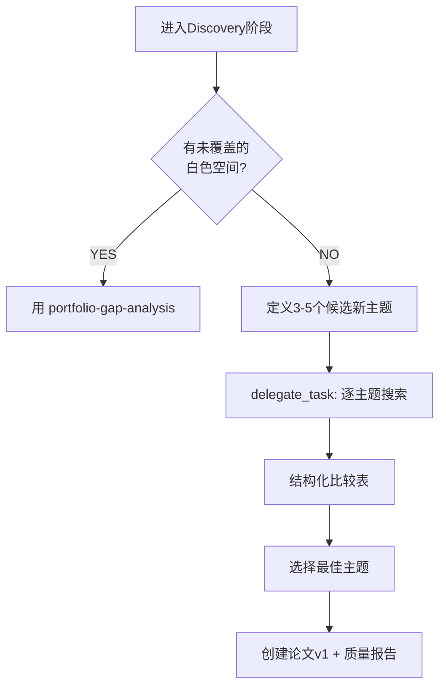

# Forward-Looking Gap Analysis via delegate_task

> 2026-05-25 | 实战: 从13篇completed+3 hold进入Discovery, 用delegate_task比较3个候选主题 → 选fundus-cv-risk-prediction

## 核心理念

Portfolio gap analysis (逆推型) 适合从**已有完成论文**中找白色空间。但当你已经完成所有主题、想拓展全新方向时，需要**前推型**分析——用 web search 评估多个候选新主题，选出最可行的。

**何时用**: 所有已完成论文已整合完毕，需要开拓之前未探索的领域。

**何时不用**: 已有论文中有明显白色空间（用 portfolio-gap-analysis 即可）。

## 执行模式



## delegate_task 调用模式

```python
# 核心调用
delegate_task(
    context="我们已有N篇完成论文覆盖领域A,B,C...",
    goal="比较候选主题X,Y,Z的可行性",
    toolsets=["web", "search"]
)
```

### context 模板

写清楚四样东西：
1. **已有资产**: "13篇完成论文涵盖: 前庭/VOR(4)、帕金森(2)、虹膜(3)、医疗AI(3)、眼底筛查(2 DR+青光眼)、系统论文(2)"
2. **候选列表**: "新候选方向: (1) AMD AI筛查 (2) 眼底心血管预测 (3) 儿科眼科AI"
3. **评估维度**: 每个主题评估: 已有系统综述数量、近2年高引论文、荟萃分析空白、文献体量(~篇数)
4. **期望输出**: "返回结构化对比表 + 推荐意见"

### goal 模板

"Research gap analysis: which of these N topics has the richest recent literature and highest research impact for a systematic review/meta-analysis? Search recent (2023-2026) literature for each candidate."

## 比较矩阵（输出格式要求）

| 准则 | 主题A | 主题B | 主题C |
|:-----|:------|:------|:------|
| 已有系统综述数 | HIGH(15+) | MOD(8-10) | LOW(4-6) |
| 荟萃分析空白 | 窄(已有多个MA) | 有缺口(无综合MA) | 主要缺口(无MA) |
| 近年高引(2024-25) | 多,但竞争大 | 多且增长快 | 少,领域较冷 |
| 文献体量(2023-26) | 2500-3500 | 1800-2500 | 600-1000 |
| 临床影响 | 高 | 最高(CVD#1杀手) | 中等 |
| 团队经验匹配 | 中(已有DR但缺AMD) | 高(眼底+AI双重匹配) | 低(无儿科经验) |

## 实战案例

### 2026-05-25: fundus-cv-risk-prediction 选题

**已有完成论文**: bppv, VOR, PD, iris, 乳腺癌AI, 糖尿病PIMA, DR筛查, 青光眼筛查, Synthos, SCF, VOG — 13篇

**候选主题**:
1. AMD AI筛查 — 已有15+系统综述, 高度拥挤
2. **眼底心血管风险预测** — 8-10综述但无综合MA, 1,800-2,500篇文献, CVD是#1死因 ✅ 选中
3. 儿科眼科AI — 仅600-1000篇, 文献量不足以支撑MA

**delegate_task 调用**:
```
context="已有13篇完成论文: 前庭类(4), 虹膜/眼动(3), 眼底AI(DR+青光眼=2), 
         医疗AI(乳腺癌3WT+糖尿病PIMA+Synthos系统+SCF教育=4), 3篇hold.
         候选: (1) AMD AI (2) 眼底CV风险 (3) 儿科眼科"
goal="Research gap analysis: compare 3 candidates for meta-analysis"
toolsets=["web","search"]
```

**结果**: 收到结构化对比表 → 选中眼底CV风险 → 创建paper v1, 8页两栏, 28引 → 写quality-report → 进入working阶段

## 鉴别两个 Gap Analysis

| 维度 | Portfolio Gap (逆推) | Forward Gap (前推) |
|:-----|:--------------------|:--------------------|
| 触发时机 | 有≥5篇完成论文, 找白色空间 | 所有白色空间已填, 需拓新方向 |
| 输入 | 已完成论文列表 | 候选新主题列表 |
| 工具 | 本地目录扫描 + 评分矩阵 | delegate_task + web search |
| 输出 | 最匹配的白色空间 | 最可行的新主题 |
| 验证需求 | 低(本地即有) | 高(需外部文献确证) |

## 陷阱

1. **不要在同一轮启动多个新论文**: 每轮只选一个主题, 创建→编译→报告→进入working
2. **不给delegate_task足够context**: 必须说明已有资产范围, 否则它给你推荐已有方向
3. **跳过文献验证直接写**: 即使分析了也还需实搜确认文献体量
4. **忽视团队经验匹配**: 再好的主题如果和已完成论文完全无关(如从眼科跳到核磁), 学习和执行成本高
