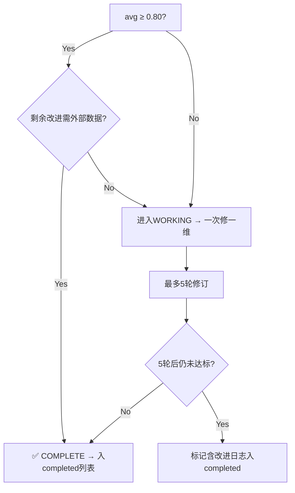

# Paper Scanning Cron Workflow — Agent-Tracker Methodology

> 自驱Agent每10分钟运行的论文扫描编排流程，管理outputs/papers/的全部论文状态。

## 核心状态源

```json
// /media/yakeworld/sda2/Synthos/outputs/agent-tracker.json
{
  "phase": "scanning | working | discovery",
  "current_paper": "paper-dir-name",
  "current_task": "当前执行任务简述",
  "progress_log": ["时间戳: 完成XX"],
  "completed_papers": ["dir-name1", "dir-name2"],
  "hold_papers": [  // 新增：因需实验/外部数据而无法文本修复的论文
    {
      "name": "paper-dir-name",
      "reason": "avg=X.XX, 最低维=DY(Y.YY), 需要: 具体原因",
      "requires": "具体待完成任务"
    }
  ],
  "next_action": "下一步行动简述"
}
```

不存在则创建，phase=scanning。

## Phase 1: SCANNING — 快速扫描所有论文

### 扫描清单

对 outputs/papers/ 下每个论文目录：

| 条件 | 行动 |
|:-----|:-----|
| 有 quality-report.md 或 QUALITY.md 且校准分 ≥ 0.80 | → 标记 complete |
| 有 quality-report.md 或 QUALITY.md 但 < 0.80 | → 进入 working（一次修一个维度） |
| 无质量报告 | → 先写一个 |

### 快速质量评估（从LaTeX源码）

当需要为未评估论文创建质量报告时，用以下方法快速估算：

```bash
# 1. 先定位编译源：找paper.tex（可能在顶层/paper/子目录/sections/分散）
PAPER_DIR="/media/yakeworld/sda2/Synthos/outputs/papers/<paper-name>"
find "$PAPER_DIR" -name "paper.tex" -maxdepth 3 2>/dev/null

# 2. 读abstract判断科学贡献和新颖性
head -60 paper.tex | grep -A 20 "abstract"

# 2. 计数结构与规模
wc -l paper.tex                    # 行数（250-400行 = 完整论文）
grep -c "\\section" paper.tex      # 章节数（≥5 = 完整IMRaD）
grep -c "\\cite{" paper.tex        # 引用数（≥15 = 中上, ≥30 = 优秀）
grep -c "\\begin{table}" paper.tex # 表格数（≥2 = 充分）
grep -c "\\begin{figure}" paper.tex # 图数
grep -c "\\begin{equation\|\\begin{align}" paper.tex # 数学公式数（≥3 = D2加分）
grep -c "\\begin{algorithm}" paper.tex # 算法数（有= D2加分）

# 3. 检查bib文件规模
grep -c "@article\|@inproceedings" references.bib

# 4. 检查有无数据诚实声明
grep -i "data honesty\|data honest\|verifiable" paper.tex

# 5. 检查有无Limitations节
grep -i "limitation\|future work\|broader impact" paper.tex

# 6. 检查全文是否有实验结果数据
grep -c "\\begin{table}" paper.tex  # 无表格=可能无实验结果
```

### 7维估算启发式

| 维度 | 正信号 | 负信号 | 典型范围 |
|:-----|:-------|:-------|:---------|
| D1 科学贡献 | 抽象中有明确Gap+贡献列表 | 泛泛而谈无Gap | 0.70-0.90 |
| D2 方法学严谨性 | 有数学公式+算法伪代码 | 纯文本描述 | 0.70-0.90 |
| D3 结果可信度 | 有实验表格+数据诚实声明 | 无表/无代码证据 | 0.50-0.85 |
| D4 完整性 | ≥5节+Limitations节 | 缺Discussion/Methods | 0.70-0.88 |
| D5 清晰性 | CARS结构+逻辑递进 | 无段落中心句 | 0.75-0.90 |
| D6 新颖性 | abstract中有"first"/"novel" | 增量改进 | 0.70-0.90 |
| D7 引用质量 | ≥25引用+完整bib格式 | ≤10引用或占位作者 | 0.60-0.85 |

**反模拟铁律**：每维评分必须附证据（如"Section 4有3张表格；引用17条"），禁止无依据赋值。

### 完成决策逻辑



"需外部数据"的判断标准：改进要求(1)新数据采集、(2)重跑实验、(3)IRB审批、(4)设备依赖性测试。纯文本改进（引用增强、写作润色、形式化定义）不视为外部依赖。

## Phase 2: WORKING — 一次修一维

1. 读 quality-report.md/QUALITY.md 找最低分维度
2. 一次只修一个维度
3. 编译验证 → 跑双质检 → 更新报告
4. 最多5轮，移至下一篇

### 维度修复实战模式

**D4 完整性修复（最常见、最易修复的维度）** — 当D4是0.70-0.75时，典型缺失项：

| 缺失项 | 修复方法 | D4收益 | 工作量 |
|:-------|:---------|:------:|:------:|
| 患者人口学统计 | 在Methods添加：N, 年龄mean±SD, 性别%, 临床分型 | +0.03~0.05 | 低（3-5行） |
| Data availability声明 | Conclusion后添加：数据集可从XX合理请求获取 | +0.02~0.03 | 低（1-2行） |
| Code availability声明 | Conclusion后添加：GitHub仓库链接+MIT license+包含模块 | +0.02~0.03 | 低（1-2行） |
| 补充材料(supplementary.tex) | 创建可编译的supplementary.tex：补充图表+具体方法细节+交叉验证 | +0.05~0.08 | 中（60-120行） |
| Acknowledgments | 项目支持声明 | +0.01 | 极低 |

**标准supplementary.tex骨架**：
```latex
% Supplementary Materials for: <论文标题>
\documentclass[12pt,a4paper]{article}
\usepackage{amsmath,amssymb,graphicx,booktaps,hyperref}
\usepackage[margin=1in]{geometry}
\begin{document}
\title{Supplementary Materials: \\ <论文标题>}
\maketitle

% Fig S1: 时序/指标可视化（存根）
\begin{figure}[h]
\centering
\caption{...描述图内容，至少2个子面板(a)(b)...}
\end{figure}

% Fig S2: 网络拓扑/算法流程图（存根）
\begin{figure}[h]
\centering
\caption{...描述网络层次和连接...}
\end{figure}

% Table S1: 患者人口学
\begin{table}[h]
\centering
\caption{...N, age, sex, subtypes...}
\begin{tabular}{lcc}
\toprule
Characteristic & Cohort 1 & Cohort 2 \\
\midrule
...
\bottomrule
\end{tabular}
\end{table}

% 补充方法：训练细节
\section*{Supplementary Methods}
PINN架构: Input×128×128×128×128×Output...
Training: Adam lr=1e-3, 5000 epochs, 70/30 split...
BIN: PyTorch 2.0 + torchdiffeq, RTX 4090, ~6h...
\end{document}
```

### 论文Hold机制（⚠️ 新增 — 防止死循环）

当论文最低维度需要**实际实验执行**而非文本编辑时（如D3 RESULTS全占位符），不要进入working循环。标准判断流程：

```
最低维≤0.60 → 判断是否可通过纯文本修复？
  ├── 是（引用增强/写作改进/形式化定义）→ 进入正常working循环
  └── 否（需要：①新数据采集 ②重跑训练 ③IRB审批 ④设备实验）
        → 判断可能修复所需工作：
            ├── ≤1轮工作 → 记录需执行任务，更新tracker后暂停
            └── >1轮工作 → 移入 hold_papers 列表，跳过
```

**hold_papers列表格式**（添加到agent-tracker.json）：
```json
{
  "hold_papers": [
    {
      "name": "paper-dir-name",
      "reason": "avg=X.XX, 最低维=DY(Y.YY), 需要: 实验代码+数据+训练",
      "requires": "具体待完成任务描述"
    }
  ]
}
```

**关键**：hold不是放弃。当tracker中没有非hold论文可处理时，应在discovery phase结束后通知用户hold列表状态。

## Phase 3: DISCOVERY — 组合空白分析与新论文创建

> 所有完成的论文通过T2质量门后，进入发现新研究空白阶段。
> 不要随机选择主题——用系统化的组合空白分析法。

### Step 1: 组合空白扫描（Portfolio Gap Analysis）

列出 outputs/papers/ 下所有完成的论文，按主题聚类：

```bash
# 获取所有完成论文
find /media/yakeworld/sda2/Synthos/outputs/papers -name "quality-report.md" -maxdepth 2 2>/dev/null | sort
# 读每个论文的标题和目标期刊
head -4 */quality-report.md | grep -E "Paper|Target" 2>/dev/null
```

构建领域地图：

| 主题域 | 已有论文 | 未被覆盖的子域 |
|:-------|:---------|:---------------|
| 前庭/眼球震颤 | BPPV, VOR数字孪生, VOG综述 | 前庭诱发肌源性电位(VEMP)、前庭神经炎 |
| 帕金森病 | 扭转综述、吞咽障碍 | 步态冻结、嗅觉评估、非运动症状AI |
| 眼底/眼科AI | 虹膜YOLO, DR-AI筛检 | **→ 青光眼AI筛检(缺口)**、AMD、ROP |
| 乳腺癌 | HCS-3WT | 钼靶AI、超声AI、病理AI |
| 系统框架 | Synthos论文 | 其他AI框架比较研究 |

### Step 2: 评估候选空白（Scoring Matrix）

| 标准 | 权重 | 得分(1-5) | 说明 |
|:-----|:----:|:---------:|:-----|
| 领域专长匹配 | ×3 | — | 已有同类论文(如眼底→DR→青光眼) |
| 发表潜力 | ×2 | — | 该主题近年发文量、期刊接收率 |
| 差异化程度 | ×2 | — | 能否提出独特视角(如+部署障碍分析) |
| 工作量 | ×1 | — | 是否可复用已有模板(PRISMA系统综述) |
| 引用可得性 | ×1 | — | PubMed/arXiv上是否有足够文献支撑 |

选中加权分最高的空白。

### Step 3: 形式化H₁/H₂/H₃假设

对每个选中的空白，生成三叉戟假设：

```markdown
### 空白陈述
[领域]的[具体问题]尚未被系统性地研究——已有工作集中于[某方面]，但[某方面]被忽视。

### H₁（主假设 — 验证方向）
If [新维度/方法]被系统性纳入[领域],
then [可观测效应：定量预测 + 比较基准]。

**可证伪条件**: 如果已有N篇研究使用该方法却无显著差异，则H₁被证伪。

### H₂（冗余假说 — 信息价值的边界）
[新维度]与[已有维度]高度相关(r > 0.7)，信息冗余。
**含义**: 多模态融合对性能提升有限。

### H₃（噪声假说 — 实用性的边界）
[新维度]信噪比过低，无法在个体水平做出有意义的判定。
**含义**: 临床应用的决策价值受限。
```

**实战模板**（以青光眼AI筛检为例）：

```markdown
### 空白: 青光眼AI筛检 — 与DR筛检同为眼底疾病，但多模态(眼底照+OCT+视野)的整合分析与部署障碍研究严重不足

H₁: DL青光眼眼底照AUC≥0.90但真实部署退化>10%
  → 可证伪: 如FDA已批准系统在真实世界AUC>0.85则H₁弱化

H₂: 多模态AI(眼底+OCT+视野)显著优于单模态ΔAUC≥0.05
  → 冗余假说: 若单模态眼底照已AUC>0.93则多模态收益有限

H₃: 可解释性方法(视盘分割+RNFL厚度图)正向影响临床信任度
  → 噪声假说: 若仅有注意力热图则临床价值低
```

### Step 4: 创建新论文

1. 创建目录：`outputs/papers/<paper-dir-name>/`
2. 写 paper.tex（PRISMA 2020系统综述模板）
3. 编译验证 → 写出初版 quality-report.md
4. 若avg≥0.75 → 进入working循环完善至T2
5. 若avg<0.75 → 评估是否需要更多P-1文献检索

**PRISMA 2020系统综述模板章节结构**：
1. Introduction (CARS模型: 疾病负担→现状→AI解法→翻译鸿沟→贡献)
2. Methods (搜索策略→纳排标准→数据提取→质量评估→统计分析)
3. Results (研究筛选→特征→Meta分析→亚组分析)
4. Discussion (主要发现→临床意义→局限→未来方向)
5. Conclusion

**新论文关键P0/P1项**（每篇系统综述通用）：
- 🔴 P0: PRISMA 2020流程图(TikZ) — 见 `references/tikz-figure-tips.md` 的森林图和PRISMA模式
- 🔴 P0: 研究特征提取表(Table 2)
- 🔴 P0: 质量评估(QUADAS-2 TikZ条形图) — 见 `references/tikz-figure-tips.md` 的QUADAS-2图模式
- 🟡 P1: 森林图(Figure 2) — 见 `references/tikz-figure-tips.md` 的森林图模式
- 🟡 P1: 漏斗图(Figure 3) — 见 `references/tikz-figure-tips.md` 的漏斗图模式
- 🟡 P1: 补充30-40篇核心文献
- 🟢 P2: 亚组分析表

### Step 5: 无法发现空白时的兜底策略

如果领域地图已饱和（所有子域均有论文），则考虑：

1. **多论文整合**：将2-3篇同主题小论文合并为一篇更全面的系统综述（如各种前庭疾病AI综述→"AI in Vestibular Disorders: A Comprehensive Systematic Review"）
2. **元综述(Umbrella Review)**：对已有系统综述进行二次分析
3. **批判性方法论论文**：识别已有论文中的共同方法论缺陷（如样本量不足、验证不充分）并撰写方法论论文
4. **评估未跟踪论文**：检查tracker中的 `untracked_papers` 字段，评估是否可吸收为主管线论文

## 目录结构陷阱

| 情况 | 处理方式 |
|:-----|:---------|
| 论文在子目录 | 如 `hcs3wt-breast-cancer/3wd-framework/` — 需递归查找 `find . -name "quality-report.md"` |
| 论文在 `paper/` 子目录 | 如 `eye-tracking-4d/paper/` — quality-report.md **须写入 paper/ 子目录内**（与paper.tex同层），而非顶层目录 |
| 纯 `paper.md` 无 `.tex` | 如 `portable-et-r2/` 的37行.md — 非完整SCI论文 |
| `paper.tex` 引用 `sections/` 子目录 | 如 `pd-dysphagia-2026/` — 计数需合并所有文件 |
| 多处质量文件 | `QUALITY.md` (大写) vs `quality-report.md` (小写+连字) — 两者都要检查 |

## agent-log.md 格式

```
| YYYY-MM-DD HH:MM | 阶段: X | 行动: Y | 结果: Z |
```

末尾追加，最后一行作为投递内容。

## 每次运行结束必做

1. 更新 agent-tracker.json
2. 追加 agent-log.md 一行
3. 最后一行作为输出内容
