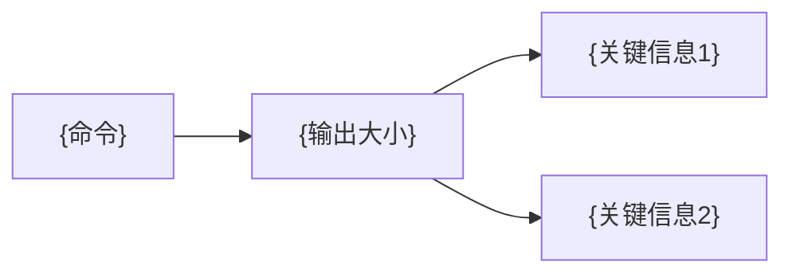

---

name: memory-optimization-system
description: 记忆系统全面优化：上下文卸载(Mermaid压缩)、FSRS巩固cron(凌晨3点)、memory↔fact_store双写。
metadata:
  synthos:
    priority: P1
    atom_type: meta-reflection
    description: 记忆系统全面优化：上下文卸载(Mermaid压缩)、FSRS巩固cron(凌晨3点)、memory↔fact_store双写。
    signature: 'memory_content: str, usage_stats: dict -> optimized_memory: str'
    related_skills: [conversation-to-memory, quality-gate, conversation-to-memory, conversation-to-memory, memory-enhancement]
---
io_contract:
  input:
    - 'memory_content: str, usage_stats: dict -> optimized_memory: str'
  output:
    - 'optimized_memory: str, consolidation_report: dict (gains: list[str], losses: list[str], fsrs_schedule: dict)'
---


# 记忆系统全面优化

> **记非日记，长养为要。散则聚之，独则连之。**

## 已部署组件

| 组件 | 脚本 | Cron | 模式 |
|:-----|:-----|:----:|:----:|
| **QC批量扫描** | `qc_batch_scan.py` | 每6h | no_agent |
| **记忆巩固** | `memory_consolidate.py` | 每天3:00 | no_agent |
| **上下文卸载** | 本skill（工作流） | 无cron | 会话内 |

## 1. 上下文卸载（Mermaid压缩）

### 触发条件

当任何工具输出超过 **10KB** 或 **50行** 时：

```
长输出 → [自动检测]
  ├── 保存原文到 ~/.hermes/context_refs/{hash}.md
  └── 替换为 Mermaid 摘要（保持上下文轻量）
```

### Mermaid 摘要模板

````markdown
<details>
<summary>📄 长输出摘要：{命令简述}</summary>



📎 全文: `~/.hermes/context_refs/{hash}.md`
</details>
````

### 实际工作流

```bash
# 1. 当检测到长输出时，自动执行:
mkdir -p ~/.hermes/context_refs/

# 2. 保存原文（terminal 的输出被管道捕获）
# 在 terminal() 后，用 execute_code 判断输出长度
# 如果 > 10KB，自动执行:

# 3. 在回复中只用摘要 + 引用路径
# 用户想看细节时: read_file ~/.hermes/context_refs/{hash}.md
```

### 卸载级别

| 级别 | 触发条件 | 行为 |
|:----:|:---------|:-----|
| L1 | 输出 > 10KB | 保存原文 + Mermaid摘要 |
| L2 | 输出 > 50KB | 只保存，回复中仅写"已保存到 {path}" |
| L3 | 命令行交互输出 | 只保存关键结果行 |

## 2. 记忆巩固（Cron每天凌晨3点）

### 运行脚本

```bash
# 手动触发
python3 ~/.hermes/scripts/memory_consolidate.py

# 输出示例:
# 🧠 [mem-consolidate] 05-30 03:00 — 首次巩固
#     Memory: 2,149/2,200 (98%)
#     Fact Store: 53 facts
#     建议: memory 空间 98% — 需清理
```

### Cron 配置

```jsonc
// 已在 cron 注册:
{
  "job_id": "9926ae23cdbc",
  "name": "memory-consolidation",
  "schedule": "0 3 * * *",
  "script": "memory_consolidate.py",
  "no_agent": true
}
```

### FSRS 评估逻辑（用于会话内手动评估记忆条目）

```python
# 快速计算
def memory_health(entry_age_days, access_count):
    """返回条目的记忆健康度评级"""
    R = 1.0 / (1.0 + entry_age_days / (9.0 * 2.5))  # 假设 S=2.5天
    if access_count == 0 and entry_age_days > 14:
        return "🟫 可移除 — 从未访问且超过2周"
    if R < 0.3:
        return "🟨 低可检索 — 建议移出 memory 或降低优先级"
    if R > 0.7 and access_count >= 2:
        return "🟢 健康 — 频繁使用"
    return "🟩 正常"
```

## 3. Memory ↔ Fact Store 桥接

### 提升规则

```
memory 空间 > 90% → 扫描可提升到 fact_store 的条目
  条件:
  - 含明确实体名（方法/工具/人）→ 适合 fact_store
  - 跨session有效 → 适合 fact_store
  - 仅在当前 session 有用 → 留在 memory 或删除
  
fact_store → memory:
  - fact_store 中 trust_score > 0.7 且 retrieval_count > 2 → 确保在 memory 中有提及
  - 条件: 当前 memory 空间 < 80%
```

### 去重规则

```
memory 和 fact_store 中内容相似度 > 80% 的条目：
  1. 以 fact_store 版本为准（有信任评分）
  2. 压缩 memory 中对应的冗余条目
  3. 记录合并日志到 memory 的合并字段
```

## 4. 会话内记忆管理检查清单

每次复杂任务（5+ 工具调用）后：

- [ ] memory 使用量 check: >90% 触发清理
- [ ] 是否有新的用户偏好/环境细节可保存
- [ ] 是否有过期条目（项目状态变化、PR已合并）可替换
- [ ] 长工具输出是否已卸载到 context_refs/
- [ ] fact_store 是否有新事实可添加

## 5. 架构全景

```
                        ┌──────────────────────┐
                        │  用户交互             │
                        └──────┬───────────────┘
                               │
              ┌────────────────┼────────────────┐
              ▼                ▼                ▼
      ┌──────────────┐ ┌────────────┐ ┌──────────────┐
      │ L0 上下文     │ │ L2 memory  │ │ L1 fact_store│
      │ session_search│ │ 2.2KB简记  │ │ 53 facts     │
      │ + context_refs│ │ 用户偏好   │ │ 实体+信任评分 │
      └──────┬───────┘ └─────┬──────┘ └──────┬───────┘
             │               │               │
             │     ┌─────────┴─────────┐     │
             │     │  consolidation    │     │
             │     │  cron (每天3:00)  │     │
             │     └─────────┬─────────┘     │
             │               │               │
             ▼               ▼               ▼
      ┌──────────────────────────────────────────┐
      │  L3 知识图谱 (未来: Obsidian/LLM-Wiki)   │
      │  通过 memory-enhancement skill 定义      │
      └──────────────────────────────────────────┘
```

- `references/cron-config-2026-05-30.md` — 已部署 cron 的完整配置记录 (qc-batch-scan + memory-consolidation)
- `references/memory-cleanup-methodology.md` — MEMORY.md ↔ fact_store 三层清理方法学（去重、合并、交叉验证）

- [ ] `memory_consolidate.py` 可运行输出报告
- [ ] `qc_batch_scan.py` 每6小时自动运行
- [ ] `memory_consolidate` cron 每天3:00自动运行
- [ ] 长工具输出 >10KB 被卸载到 context_refs/
- [ ] memory 空间 >90% 触发清理建议

## 陷阱

1. **context_refs 目录膨胀** — 所有长输出都保存会占用磁盘。建议保留最近30天，用 `find ~/.hermes/context_refs/ -mtime +30 -delete` 定期清理。
2. **Mermaid摘要过于简略** — 关键数据（错误消息、路径、数值）必须保留下钻路径。摘要可以简，但不能丢失恢复原文的能力。
3. **不卸载短输出** — 输出 < 5KB 不卸载，卸载本身有开销。保持简单。
4. **memory 清理不可逆** — 删除了但用户说"我之前说过"会尴尬。替换前检查 session_search 是否保存了原始记录。
