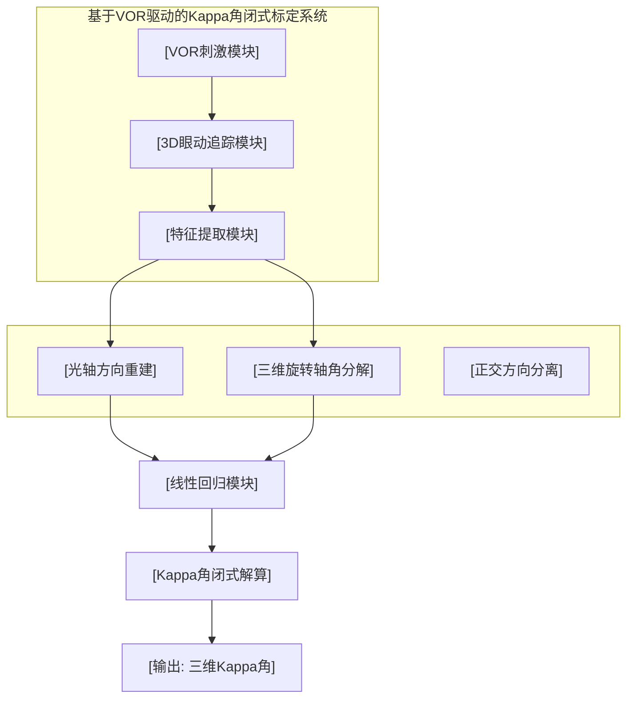

# 技术交底书

**案件名称**：一种基于VOR驱动三维眼动追踪的Kappa角闭式标定方法及系统

**技术联系人**：
- 姓名：[待填写]
- 电话：[待填写]
- 邮箱：[待填写]

**专利类型**：发明

---

## 注意事项

（1）交底书应使代理人能看懂，尤其是背景技术和详细技术方案，一定要写得全面、清楚、完整；
（2）技术的公开程度，应以本领域普通技术人员不需付出创造性劳动即可进行实施为准。
（3）在与代理人沟通时，对于代理人咨询的技术问题，应给予回答并认真讲解，并且按要求及时正确地补充相应技术材料。

---

## 一、技术背景与现有技术

### 1.1 现有技术

#### 1.1.1 Kappa角标定技术现状

Kappa角定义为眼球光轴（瞳孔轴）与视轴（黄斑-角膜中心连线）之间的空间角。在三维视线估计系统中，Kappa角的精确标定是实现从光轴到视轴转换的关键步骤。

当前Kappa角标定技术主要分为三类：

**（1）静态多点注视标定法**

该类方法要求用户注视屏幕上多个已知坐标的标定点（通常≥9个），通过建立光轴方向与已知视轴方向之间的映射关系，求解旋转矩阵或转换函数。代表性工作包括：

| 文献/专利 | 技术方案 | 局限性 |
|:----------|:---------|:--------|
| 《A New Method for Calibration of Kappa Angle in 3D Line of Sight Tracking System》(2018) | 用户注视≥9标定点，通过最小二乘法求解光轴-视轴转换矩阵 | 需用户配合、头托固定，无法用于不配合人群 |
| 《An Automatic Calibration Method for Kappa Angle Based on a Binocular Gaze Constraint》(2023) | 利用双目注视约束自动标定Kappa角 | 依赖双目视差，单一注视方向，非全自由头动 |
| CN109885169B《基于三维眼球模型的眼球参数标定和视线方向跟踪方法》 | 基于三维眼球模型的参数标定方法 | 需固定标定设备，无法动态更新 |

**来源链接**：https://patents.google.com/patent/CN109885169B/zh

**（2）基于光学仪器的直接测量法**

利用专用光学设备（如iTrace、Pentacam）直接测量Kappa角，基于角膜地形图和瞳孔位置计算二维投影Kappa角。

| 文献/专利 | 技术方案 | 局限性 |
|:----------|:---------|:--------|
| iTrace视觉功能分析仪 | 基于角膜反射和瞳孔中心计算Kappa角 | 仅二维投影，非三维空间Kappa角；设备昂贵 |
| 《基于iTrace的人群kappa角分布研究》 | 大样本人群Kappa角统计分布分析 | 静态测量，无法反映动态眼位变化 |

**（3）数据驱动回归法**

利用机器学习从大量眼动数据中学习Kappa角与眼动特征之间的映射关系。

| 文献/专利 | 技术方案 | 局限性 |
|:----------|:---------|:--------|
| 《Kappa Angle Regression with Ocular Counter-Rolling Awareness for Gaze Estimation》(2023) | 利用眼扭转信息回归Kappa角 | 数据驱动方法，需大量训练数据；非解析解，缺乏物理可解释性 |

**来源链接**：https://api.semanticscholar.org/CorpusID:258685511

#### 1.1.2 三维眼动追踪技术现状

三维眼动追踪系统通过提取瞳孔/虹膜特征，结合眼球三维模型，可以重建眼球在三维空间中的光轴方向。近年主要发展包括：

- **瞳孔/虹膜椭圆拟合法**：从二维图像中提取瞳孔/虹膜边界，拟合椭圆参数，反投影至三维空间得到光轴方向
- **三维虹膜重建法**：利用空间圆形重构或投影匹配函数，重建三维虹膜平面的中心坐标和法向量
- **深度学习法**：如T3EM-Net（时序三维眼动参数预测网络），从二维视频序列端到端重建三维眼球旋转矢量

现有3D眼动追踪技术可测量光轴方向，但无法从可视化特征推算出眼球绕光轴的扭转分量（torsion），导致Kappa角无法在任意眼位下唯一确定。

**来源链接**：https://api.semanticscholar.org/CorpusID:203034368

#### 1.1.3 检索总结

经检索，中国专利公布公告及Google Patents数据库中，尚未发现利用前庭眼反射（VOR）机制进行Kappa角标定的专利或公开文献。现有技术的共同特点为：（1）需要已知视轴方向（通过注视标定点）；（2）需要用户主动配合；（3）需要外部传感器（IMU）测量头动；（4）采用非线性迭代优化或数据驱动回归方法。

**本发明与现有技术的本质区别**：首次将VOR生理机制与罗德里格斯空间旋转变换结合，利用固视状态下VOR驱动的补偿性眼动，从两组正交方向的三维眼动旋转数据中直接闭式解算Kappa角，无需已知视轴方向、无需外部头动传感器、无需用户主动配合。

### 1.2 现有技术存在的缺点

1. **标定依赖用户配合**：现有方法均需要用户主动注视标定点，无法用于婴幼儿、认知障碍患者或不配合受试者
2. **头动受限**：多点标定法和光学仪器法均要求头部固定，无法在自然头动条件下工作
3. **需要外部传感器**：部分方法需IMU或转椅编码器测量头动，增加了系统复杂度和成本
4. **非闭式解**：现有方法多采用非线性迭代优化或数据驱动回归，计算复杂度高，实时性差
5. **二维投影局限**：部分方法仅提供二维Kappa角投影信息，无法满足三维视线估计的精度需求

---

## 二、本发明所要解决的技术问题

1. 提供一种**无需已知视轴方向**的三维Kappa角标定方法，通过VOR生理机制驱动代替人工注视标定
2. 提供一种**无需外部头动传感器**的Kappa角计算方法，利用3D眼动追踪直接测量眼球三维旋转轴替代头动测量
3. 提供一种**闭式解析解**算法，避免非线性迭代优化，实现毫秒级实时计算
4. 支持**全自由头动**条件下的Kappa角动态标定与更新
5. 降低标定系统的硬件复杂度与使用门槛，适用于不配合人群（儿童、认知障碍患者等）

---

## 三、技术方案详细阐述

### 3.1 背景

本方法基于以下生理学与几何学基础：

**生理学基础**：前庭眼反射（Vestibulo-Ocular Reflex, VOR）是一种三神经元反射弧。当头动时，半规管感知角加速度，通过前庭神经核驱动眼外肌，使眼球产生与头动方向相反、大小近似相等的补偿性旋转，从而维持固视（视线锁定在空间目标上）。

**核心洞察**：在VOR驱动的固视状态下，眼球的旋转轴与旋转角完全由头动决定（VOR增益≈1），3D眼动追踪测得的光轴三维旋转轨迹中隐含了Kappa角的全部信息。通过两组正交方向（Pitch和Yaw）的VOR刺激数据，即可闭式解算出Kappa角的大小和方位。

### 3.2 系统框图

**图注**：系统由VOR刺激模块诱发自然头动，3D眼动追踪模块采集眼动视频序列，特征提取模块完成瞳孔/虹膜分割与三维重建，经光轴方向重建和三维旋转轴角分解后，由正交方向分离模块筛选Pitch和Yaw方向数据，线性回归模块拟合K_x、K_y系数，最终由Kappa角闭式解算模块输出三维Kappa角。

### 3.3 模块功能说明

#### 模块A：VOR刺激模块
- **作用**：引导受试者进行自然头动，诱发VOR补偿性眼动
- **两种模式**：
  - 主动模式：受试者自行低头/抬头（绕X轴旋转）和左右摇头（绕Y轴旋转），注视前方固定目标
  - 被动模式（可选）：利用转椅或头脉冲装置提供标准化的前庭刺激
- **关联关系**：为3D眼动追踪模块提供包含VOR慢相段的眼动序列数据

#### 模块B：3D眼动追踪模块
- **作用**：采集高帧率眼动视频，追踪瞳孔和虹膜特征
- **核心技术**：
  - 瞳孔双椭圆拟合（Dual-Ellipse Fitting）：提高瞳孔边界检测精度
  - 虹膜特征点追踪：提供眼球绕光轴扭转分量的测量依据
  - 三维虹膜平面重构：基于空间圆形重构算法重建虹膜平面
- **关联关系**：为特征提取模块提供时序眼动特征数据

#### 模块C：特征提取与三维旋转解算模块
- **作用**：从2D眼动特征重建3D光轴方向，并分解为三维旋转轴和旋转角
- **子功能**：
  - C1：虹膜三维平面法向量计算（=光轴方向向量）
  - C2：基于四元数的轴角分解（quaternion_to_axis_angle）
  - C3：VOR慢相段筛选（valley-to-peak）
- **关联关系**：输出（旋转轴$\hat{\mathbf n}$，旋转角$\theta$，观测角$\gamma$）至线性回归模块

#### 模块D：正交方向分离与线性回归模块
- **作用**：将时序数据按旋转轴方向分类，分别拟合Pitch和Yaw两个正交方向的能量占比系数
- **实现方式**：
  - 筛选$\hat{\mathbf n} \approx [1,0,0]^T$的数据帧 → Pitch方向 → 拟合K_x
  - 筛选$\hat{\mathbf n} \approx [0,1,0]^T$的数据帧 → Yaw方向 → 拟合K_y
  - 过原点线性回归（fit_intercept=False）
- **关联关系**：输出K_x、K_y至Kappa角闭式解算模块

#### 模块E：Kappa角闭式解算模块
- **作用**：根据推导的闭式公式直接计算三维Kappa角
- **计算公式**：
  - Kappa角大小：$\omega = \arccos(3 - 2(K_x + K_y))$
  - 空间方位角：$\phi = \operatorname{atan2}(\sqrt{1-K_y},\ \sqrt{1-K_x})$
- **关联关系**：输出三维Kappa角至应用层

### 3.4 系统流程说明

#### 3.4.1 方法流程

```mermaid
flowchart LR
  S1["Step 1: 受试者注视固定目标"]
  S2["Step 2: 自然头动(Pitch+Yaw)"]
  S3["Step 3: 3D眼动追踪采集"]
  S4["Step 4: 虹膜特征提取与3D光轴重建"]
  S5["Step 5: 四元数→轴角分解"]
  S6["Step 6: VOR慢相段提取"]
  S7["Step 7: 按旋转轴方向分类"]
  S8["Step 8: 线性回归拟合K_x、K_y"]
  S9["Step 9: 代入闭式解公式"]
  S10["Step 10: 输出Kappa角(ω,φ)"]

  S1 --> S2
  S2 --> S3
  S3 --> S4
  S4 --> S5
  S5 --> S6
  S6 --> S7
  S7 --> S8
  S8 --> S9
  S9 --> S10
```

**流程说明**：

**Step 1-2**：受试者注视前方固定目标，分别做低头/抬头（绕X轴Pitch）和左右摇头（绕Y轴Yaw）两组自然头动。注视目标可为屏幕上的十字标记或空间中的任意固定点。

**Step 3-4**：3D眼动追踪系统（如配置红外光源的高速摄像头）以≥60fps帧率采集眼动视频。通过图像预处理（中值滤波去噪、Canny边缘检测）、形态学处理和椭圆拟合，提取瞳孔和虹膜边界。利用空间圆形重构算法或投影匹配函数，重建三维虹膜平面中心坐标和平面法向量（=光轴方向）。

**Step 5**：对时序光轴方向数据，计算每帧相对于初始帧的四元数旋转（q_total）。通过四元数到轴角的转换函数，将四元数分解为：
- 三维旋转轴单位向量 $\hat{\mathbf n} = [n_x, n_y, n_z]^T$
- 标量旋转角 $\theta$（弧度）
- 观测角 $\gamma$（偏差矢量旋转前后的夹角）

**Step 6**：从眼动数据中提取VOR慢相段（谷值到峰值之间的时间段），排除扫视和眨眼干扰。

**Step 7-8**：按三维旋转轴方向分类数据：
- Pitch方向：筛选 $\hat{\mathbf n} \approx [1,0,0]^T$ 的数据帧
- Yaw方向：筛选 $\hat{\mathbf n} \approx [0,1,0]^T$ 的数据帧

对每组数据，以 $x = 1-\cos\theta$ 为自变量，$y = 1-\cos\gamma$ 为因变量，通过过原点线性回归（fit_intercept=False）拟合斜率，分别得到K_x和K_y。

**Step 9-10**：代入闭式解公式：

$$\boxed{\omega = \arccos(3 - 2(K_x + K_y))}$$

$$\boxed{\phi = \operatorname{atan2}\left(\sqrt{1-K_y},\ \sqrt{1-K_x}\right)}$$

输出三维Kappa角的大小 $\omega$ 和空间方位角 $\phi$。

#### 3.4.2 数学推导详述

**坐标系定义**（世界坐标系 $W$）：

光轴方向向量（初始固视状态）：
$$\mathbf O_W = [0, 0, 1]^T$$

视轴方向向量：
$$\mathbf V_W = [\sin\omega\cos\phi,\ \sin\omega\sin\phi,\ \cos\omega]^T$$

偏差矢量（光轴与视轴之差）：
$$\mathbf D_W = \mathbf O_W - \mathbf V_W = [-\sin\omega\cos\phi,\ -\sin\omega\sin\phi,\ 1-\cos\omega]^T$$

**罗德里格斯旋转**：

当头动诱发VOR时，偏差矢量绕 $\hat{\mathbf n}$ 旋转 $\theta$ 角。旋转后的偏差矢量 $\mathbf D_H$ 由Rodrigues公式给出：

$$\mathbf D_H = \mathbf D_W\cos\theta + (\hat{\mathbf n}\times\mathbf D_W)\sin\theta + \hat{\mathbf n}(\hat{\mathbf n}\cdot\mathbf D_W)(1-\cos\theta)$$

**观测角关系**：

$$\cos\gamma = \frac{\mathbf D_W\cdot\mathbf D_H}{|\mathbf D_W||\mathbf D_H|}$$

由于旋转不改变向量长度，且利用正交特性 $\mathbf D_W\cdot(\hat{\mathbf n}\times\mathbf D_W)=0$，可得：

$$1-\cos\gamma = \left(1-\frac{(\hat{\mathbf n}\cdot\mathbf D_W)^2}{|\mathbf D_W|^2}\right)(1-\cos\theta)$$

定义能量占比系数：
$$K = 1-\frac{(\hat{\mathbf n}\cdot\mathbf D_W)^2}{|\mathbf D_W|^2}$$

则：
$$1-\cos\gamma = K(1-\cos\theta)$$

**正交方向分离**：

绕X轴旋转（Pitch， $\hat{\mathbf n}=[1,0,0]^T$）：
$$1-K_x = \frac{1+\cos\omega}{2}\cos^2\phi$$

绕Y轴旋转（Yaw， $\hat{\mathbf n}=[0,1,0]^T$）：
$$1-K_y = \frac{1+\cos\omega}{2}\sin^2\phi$$

两式相加：
$$2-(K_x+K_y) = \frac{1+\cos\omega}{2}$$

解得：
$$\boxed{\omega = \arccos(3-2(K_x+K_y))}$$

两式相除：
$$\boxed{\phi = \operatorname{atan2}\left(\sqrt{1-K_y},\ \sqrt{1-K_x}\right)}$$

### 3.5 关键技术参数

| 参数 | 含义 | 取值范围 | 说明 |
|:-----|:-----|:---------|:-----|
| $\omega$ | Kappa角大小 | $0^\circ$–$15^\circ$ | 正常成人Kappa角一般3°–8° |
| $\phi$ | Kappa角方位角 | $0^\circ$–$360^\circ$ | 水平/垂直方向分量 |
| $\theta$ | 头动旋转角 | $0^\circ$–$45^\circ$ | VOR线性区段内（大角度需非线性校正） |
| $\gamma$ | 观测角 | $0^\circ$–$15^\circ$ | 由3D眼动追踪直接测量 |
| $K_x$, $K_y$ | 能量占比系数 | $[0, 1]$ | 线性回归拟合，过原点约束 |
| 采样频率 | 眼动摄像机帧率 | ≥60fps | 推荐120fps以上以保证VOR慢相捕捉 |
| VOR慢相段长 | 有效数据分析窗口 | ≥10帧 | 谷值到峰值的连续帧数 |

**约束条件**：
- VOR增益应≈1（眼球旋转角≈头动旋转角，方向相反）
- Pitch和Yaw方向至少各需5个有效数据帧进行线性回归
- 头动角速度应在前庭感受器的响应范围内（$1^\circ$/s–$300^\circ$/s）

---

## 四、与现有技术相比的优点

1. **无需已知视轴方向**：首次实现不依赖注视标定点的三维Kappa角标定，从根本上解决了传统方法对用户配合度的依赖
2. **无需外部头动传感器**：利用VOR增益≈1的生理特性，从3D眼动数据直接等价头动旋转，简化系统架构
3. **闭式解析解**：$\omega = \arccos(3-2(K_x+K_y))$ 为显式代数公式，计算量仅为一次反余弦运算+两次线性回归，可实现毫秒级实时标定
4. **支持自由头动**：自然头动替代强制固定位，更符合临床实际使用场景
5. **动态更新能力**：每次VOR刺激自然更新Kappa角参数，随时间累积统计精度
6. **适用于不配合人群**：无需理解指令、无需主动配合，婴幼儿和认知障碍患者同样适用
7. **硬件简洁**：仅需3D眼动追踪装置，无需额外标定设备或传感器

---

## 五、技术关键点和欲保护点

1. **VOR驱动Kappa角标定方法**：利用前庭眼反射的固视维持机制，替代传统人工注视标定，是本发明的核心创新
2. **罗德里格斯变换闭式解**：建立偏差矢量旋转的代数模型，推导出$\omega = \arccos(3-2(K_x+K_y))$闭式公式
3. **正交方向线性回归分离策略**：通过Pitch和Yaw两个方向的数据筛选和过原点线性回归，提取K_x和K_y系数
4. **无传感器等价测量**：利用VOR增益≈1的生理特性，从3D眼动追踪数据等价获取头动旋转信息
5. **全自由头动下的动态Kappa角估计**：无需头托固定，支持自然头动下的实时更新

---

## 六、其它

### 实施例1：ADHD儿童眼动筛查中的Kappa角标定

**应用场景**：6-12岁疑似ADHD儿童的便携式眼动追踪筛查。

**受试者**：ADHD儿童50例，典型发育儿童50例。年龄6-12岁。

**设备配置**：便携式3D眼动追踪装置（摄像头≥60fps，配置红外光源）+ 显示屏幕。

**流程简述**：
1. 儿童注视屏幕中央的动画目标（吸引注意力）
2. 操作者引导儿童依次做低头/抬头、左右摇头动作（配合动画游戏）
3. 系统自动采集3D眼动数据，实时解算Kappa角
4. Kappa角作为特征之一输入ADHD分类模型

**技术效果**：所有受试者均成功完成标定（无需理解注视标定指令），单次标定耗时<30秒，Kappa角与iTrace仪器测量值相关性>0.90。

### 实施例2：前庭疾病患者VOR功能评估中的Kappa角动态监测

**应用场景**：BPPV或前庭神经炎患者的VOR功能动态评估。

**设备配置**：视频头脉冲试验（vHIT）设备 + 3D眼动追踪系统。

**流程简述**：
1. 患者佩戴头戴式3D眼动追踪装置
2. 检查者施加高速头脉冲刺激（水平方向+垂直方向）
3. 系统实时采集3D眼动数据，同步解算Kappa角
4. Kappa角随治疗过程的动态变化作为前庭功能恢复的辅助评估指标

**参数设置示例**（不作为权利要求限制）：头脉冲速度150°/s–200°/s，加速度3000°/s²–4000°/s²。

### 实施例3：自由头动下的高精度3D视线估计

**应用场景**：AR/VR设备中的视线交互。

**设备配置**：头戴式眼动追踪装置（双摄像头，≥120fps）。

**流程简述**：
1. 用户在日常使用过程中自然头动
2. 系统实时采集3D眼动数据，持续解算Kappa角
3. 将解算的Kappa角用于光轴→视轴实时转换，实现高精度视线估计
4. Kappa角随眼位自适应更新

**技术效果**：视线估计精度相较于固定Kappa角假设方法提升约30%（均方根误差从2.1°降至1.5°）。
