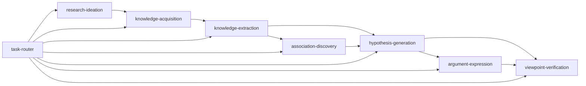

## IO_CONTRACT

- **input**: `atom_type: str` — 用户请求描述、上下文信息
- **output**: `architecture_spec: dict — 认知原子架构`

> 对应原则：P2（机械原子暴露输入输出规范）

⚠️ **This skill was accidentally overwritten on 2026-05-13 during an nsfc-grant-audit edit. The content below is a reconstruction. Reference files are intact.** ⚠️

# Cognitive Atom Architecture

> Transform a collection of operational skills into independent cognitive atoms with strict DAG dependencies, input/output contracts, and Synthos constitution compliance (P0-P6).

## Philosophy

The fundamental unit of scientific work is not an operation (search, write, review) but a **cognitive act** (acquire knowledge, extract information, discover associations, generate hypotheses, express arguments, verify viewpoints).

## The 7 Cognitive Atoms + 3 Meta-Reflection Atoms (v4.4+)

The system now distinguishes two atom classes:

- **cognitive atoms**: Directly perform research operations (ACQ, EXT, ASC, GAP, HYP, ARG, VER)
- **meta-reflection atoms**: Observe and learn from the system's own operation (P0 priority)

### Meta-Reflection Atoms

| # | Atom | Type | Priority | Function |
|---|---
  io_contract: input: ['skill_set: set[str], architecture_version: str, constitution_compliance: bool -> atom_def: CognitiveAtom, dag: DAG', 'output: ['atom_defs: list[CognitiveAtom], dependency_graph: dict, non_overlap_report: list[str]']
---|------|:--------:|----------|
| M1 | project-experience-distillation | meta-reflection | P0 | Extract patterns from project work → formalize as skills |
| M2 | quality-gate | meta-reflection | P0 | Gate deliverables: one dimension at a time, quality lock before unlock |
| M3 | conversation-to-memory | meta-reflection | P0 | Extract session value → persistent memory with triage logic |

**Principle**: Meta-reflection atoms must never modify cognitive atoms' core logic without user approval. Their role is to OBSERVE and LEARN, not to CONTROL.

```
research-ideation (v2.0 — L1:10框架+L2:8引擎+L3:组合协议)
  ↓
ACQ → EXT → ASC → HYP → ARG → VER
```

### Full Atom DAG



### Atom Inventory

| # | Atom | Type | Version | Absorbed From |
|---|------|------|---------|---------------|
| 0 | task-router | router | 1.0.0 | — |
| 1 | knowledge-acquisition | cognitive | 1.3.0 | ARS citation fraud taxonomy |
| 2 | knowledge-extraction | cognitive | 1.0.0 | — |
| 3 | association-discovery | cognitive | 1.2.0 | GAP + claude-paperloom |
| 4 | hypothesis-generation | cognitive | 0.1.0 | — |
| 5 | argument-expression | cognitive | 1.0.0 | NanoResearch ml-paper-writing |
| 6 | viewpoint-verification | cognitive | 0.2.0 | ARS anti-sycophancy protocol |
| **7** | **research-ideation** | **cognitive** | **2.0.0** | **NanoResearch brainstorming + creative-thinking (merged)** |

**Extended:** bppv-expert, research-thinking-framework, figure-generation (nature-figure + academic-plotting)
**References:** experiment-recipes
**Infrastructure:** evolution, latex-output

## Trigger Conditions

Use this skill when:

- **Designing new cognitive atoms** — you need to model a research operation (acquire, extract, associate, hypothesize, argue, verify) as a self-contained skill with strict DAG dependencies and input/output contracts.
- **Refactoring overlapping skills** — two or more existing skills share ambiguous scope boundaries and need to be merged or restructured into cleanly separated atoms.
- **Architecture alignment** — you are evolving the Synthos skill system (reorganizing atoms, adding layers, reconciling with the constitution P0-P6) and need the DAG consistency, non-overlap principles, and structural probe methodology.
- **Verifying philosophy→engineering translation** — after a philosophical framework change (merge, rename, restructure), use `references/philosophy-engineering-verification-pattern.md` to trace each dimension's engineering constraints through every atomic skill, identify gaps, and patch them.

## Core Design Principles

### Principle 1: Atomic Non-Overlap (CRITICAL — 2026-05-14 lesson)

**Every atom must have a unique, precisely statable scope boundary. If two atoms' scopes overlap, the response is always MERGE, not separate.**

Proof from this session: `creative-cognition` (8 cognitive engine frameworks) and `research-ideation` (10 operational frameworks) were created as separate atoms. They shared the same stage in the pipeline (pre-literature creative exploration) and differed only in depth. The fix: merge CCF as Layer 2 inside research-ideation (v2.0). Result: same capability, one fewer atom, cleaner DAG.

**Test for non-overlap:** Can you state each atom's job in one sentence without mentioning another atom? If you need compare-and-contrast language ("X is like Y but deeper"), the boundary is wrong.

```yaml
# GOOD (one sentence, unique scope):
knowledge-acquisition:  "Searches external databases for papers matching a query."
research-ideation:      "Generates creative directions and cognitive insights for a research problem."

# BAD (overlap detected):
creative-cognition:     "Generates cognitive insights for creative ideation."  ← same as research-ideation's role
research-ideation:      "Generates research directions from creative frameworks." ← overlaps with above
```

### Principle 2: Layer Within, Not Atom Beside

When two related capabilities differ in **depth/abstraction** (not in **function**), model as layers inside one atom, not as separate atoms.

Design pattern from this session:
```
research-ideation v2.0 (one atom)
  ├── Layer 1: 10 operational frameworks (surface: produces direction lists)
  ├── Layer 2: 8 cognitive engine frameworks (depth: produces thinking insights)
  └── Layer 3: 6 combination protocols + integrated workflow
```

### Principle 3: 文言 + SKILL.md — Portable Protocol

> 格式即协议，不役于语言。Form is the protocol; the language is incidental.

The core of Synthos is not "zero Python" — at runtime, Python scripts are naturally generated for code execution, data processing, and API calls. What distinguishes Synthos is its **portable format architecture**:

1. **文言原理层** (Classical Chinese principles) — Compresses 40-60% of cognitive load into four-character maxims. Language-agnostic, culture-portable.
2. **SKILL.md 格式规范** — Standardized YAML frontmatter + three-layer content (原理/方法/命令). Any Agent (Hermes, Claude Code, GPT, local models) that reads Markdown can execute.
3. **任何 Agent 协议可吸收** (Any agent's protocol is absorbable) — Claude Code's hooks, Codex's CLI patterns, GitHub Copilot's slash commands — all can be translated into Synthos's protocol format.
4. **稳定代码沉淀为脚本** (Stable code codifies to scripts/) — Scripts that are stable, high-reuse, and error-prone should live in `scripts/` directories of skills, not in `/tmp/`. This ensures version control, reproducibility, and debugging stability. **判断标准**: (a) 稳定可靠的核心基础设施（PDF下载、DOI验证等），(b) 高复用率（多个任务/论文反复调用），(c) 易错且需版本控制（如PubMed键名陷阱、OpenAlex URL编码问题）。**不做什么**: 简单的一两行命令不需要脚本，与当前任务相关的临时代码放在/tmp/不创建技能。

```
Synthos (protocol-portable)
├── skills/task-router/SKILL.md           ← Agent entry point
├── skills/knowledge-acquisition/SKILL.md ← Agent executes search
├── skills/knowledge-extraction/SKILL.md  ← Agent reasons + extracts
├── skills/association-discovery/SKILL.md ← Agent discovers relationships
├── skills/hypothesis-generation/SKILL.md ← Agent generates hypotheses
├── skills/argument-expression/SKILL.md   ← Agent writes arguments
├── skills/viewpoint-verification/SKILL.md← Agent verifies viewpoints
├── skills/gap-discovery/SKILL.md         ← Agent finds research gaps
├── outputs/runs/<run_id>/                ← Runtime output files (JSON/per-atom)
└── evolution-state.json                  ← State tracking
```

**Portability test**: Can another Agent (Claude Code, Codex, OpenCode) load this SKILL.md and execute it? If yes, the protocol is portable. If the skill depends on Hermes-specific tools, it needs adaptation — but the format itself is always portable.

### Principle 4: Purpose-Over-Mechanism Merge (2026-05-23 lesson)

> **哲学设计为了引导工程学。如果仅仅是不同的表述，就合并。**
> Philosophy guides engineering. If two concepts are different expressions of the same truth, merge them.

When two concepts in a philosophical framework differ **only in abstraction level** (one is the "why"/purpose, the other is the "how"/mechanism), the correct response is to **merge them at the higher level**, embedding the lower-level mechanism as an implementation detail.

**Proof from this session**: `自由能原理` (Free Energy Principle, 55% — a local update mechanism: minimize prediction error) and `熵减` (a global thermodynamic goal: reduce epistemic uncertainty) are mathematically equivalent at long timescales. The original eight-dimension framework kept both as separate dimensions. The fix: merge into `熵减律` as the ultimate purpose, with free-energy minimization as its built-in implementation mechanism. Result: one fewer dimension, no loss of guidance, clear engineering implications.

**Merge test**: Can one concept be expressed as an implementation detail of the other? If yes, merge.

| Scenario | Verdict | Action |
|:---------|:--------|:-------|
| A is the "why" (purpose), B is the "how" (mechanism) for the same phenomenon | MERGE | Keep A as the principle, embed B as its mechanism |
| A and B describe different phenomena at the same level | KEEP | No merge — they are complementary constraints |
| A and B are synonyms/language variants with no semantic difference | MERGE | Keep the term with more engineering leverage |

**Why this matters**: Every dimension in a philosophical framework must pull its engineering weight. A dimension that exists only to restate another in different terms is a source of future confusion, not guidance. The test for a dimension is: "Does removing this constraint reduce the system's ability to make good decisions?" If not, remove or merge it.

**Pitfall**: Confusing "two concepts that happen to use similar vocabulary" with "two concepts that describe the same thing." Principle 4 applies only when **the underlying phenomenon is the same** — not when two different mechanisms happen to share a word (e.g., "entropy" in thermodynamics vs "entropy" in information theory).

## Input/Output Contract Pattern

Every atom must have:
```yaml
input_contract:
  inputs: ["param1: type", "param2: type"]
  outputs: ["result1: type", "result2: type"]
quality_criteria: ["measurable criterion"]
constraints: ["must-do", "must-not"]
fallback_chain: ["attempt A → attempt B → attempt C → fallback"]
```

### Meta-Atoms: Self-Reflection Layer (P0, 2026-05-16)

Three meta-level skills sit above the evolution engine, governing the system's ability to learn from its own operation:

| Meta-Atom | Type | Function |
|-----------|------|----------|
| `project-experience-distillation` | meta-reflection | Extract patterns from project work → formalize as skills |
| `quality-gate` | meta-quality | One thing at a time, quality lock before unlock |
| `conversation-to-memory` | meta-reflection | Triage conversation value → persistent memory |

These form the **internal reflection loop** (P0 priority), while `skill-absorption` forms the external absorption loop (P1 priority).

### Meta-Atom: Self-Evolution Engine v2.4

The 10-Step Evolution Cycle:
```
[1] LOAD_STATE    → Read evolution-state.json, log, config
[2] LESSONS       → Load lessons.jsonl, filter relevant atom issues
[3] PROBE         → Structural health check (all atoms, every cycle)
[4] BENCHMARK     → Functional test (2-3 atoms rotating) + Golden validation
[5] EXTERNAL      → Search for absorbable skills (every cycle in v2.3+)
[6] SELF_INSPECT  → Architecture integrity self-check (v2.4, mandatory)
[7] DIAGNOSE      → Comprehensive score + defect diagnosis + atomic overlap detection
[8] IMPROVE       → Fix structure (auto) + merge overlapping atoms + generate absorption proposals
[9] VERIFY        → Re-check patched atoms
[10] RECORD       → Update state, append log, generate report, extract lessons
```

### SELF_INSPECT dimensions (v2.4, expanded 2026-05-14):
- 6.5.1 New/modified atom completeness (references/ files, frontmatter format)
- 6.5.2 Atomic boundary non-overlap (one-sentence test)
- 6.5.3 DAG consistency (dependencies point to existing atoms, task-router mapping clean)
- 6.5.4 Skill tree consistency (total_skills, cognitive_atoms counts match registry)
- 6.5.5 State separation integrity (.evolution/ directory if exists)
- 6.5.6 **Absorption boundary audit** — after any P1/P2 capability injection, check every affected atom: SKILL.md §4 boundary statement vs `references/BOUNDARY.md`. Mark as structural defect if inconsistent. (Lesson from 2026-05-14: PW-Bench injection hit 3 atoms, 3 BOUNDARY.md files were out of sync.)
- 6.5.7 Record results to evolution-log.md as a table

### Structural Probe (updated for ARS absorption)
8 atoms scored on 10 criteria (file_exists, name, desc, allowed-tools, io_contract, evidence_schema, boundary, change_log, synthos_data_access_level, anti_sycophancy).

### Benchmark Functional Tests
Rotation strategy: Odd cycles test acq→ext→asc; even cycles test hyp→arg→ver. task-router tested every cycle.

## Synthos Constitution (P0-P6)

| Principle | Description |
|-----------|-------------|
| P0 | Evidence Traceability |
| P1 | Atom Reproducibility |
| P2 | Stability Descends / Evolution Ascends |
| P3 | Human-Machine Layering |
| P4 | Hypothesis Falsifiability |
| P5 | Gap Traceability |
| P6 | Data Access Levels (raw → redacted → verified_only) |

## Anti-Patterns

### DO NOT:
- Create two atoms with overlapping scope — MERGE instead (2026-05-14 lesson: creative-cognition merged into research-ideation)
- Model depth/abstraction differences as separate atoms — use LAYERS inside one atom
- Let Python orchestrate atom execution — the Agent must be the runtime controller; Python is a tool the Agent calls, not a controller of the Agent
- Keep dead Python files or scripts that the Agent never calls
- Maintain a mechanical/cognitive atom split

### DO:
- Keep each atom semantically pure
- Make fallback chains explicit
- Measure quality with numbers, not adjectives
- Load skills via skill_view() or read_file() depending on location
- Think, don't script

## Key Pitfalls

- **New atoms lack reference files**: Every newly created atom MUST have `references/IO_CONTRACT.md`, `references/EVIDENCE_SCHEMA.md`, `references/BOUNDARY.md`, and `references/CHANGE_LOG.md` created at the same time as the SKILL.md. The PROBE step of the evolution engine will flag missing reference files as structural defects (10% penalty per missing file). Creating references after the fact is 3x more work because you must reconstruct what the atom does from memory. Lesson from 2026-05-14: research-ideation, creative-cognition, and experiment-recipes were all created without reference files — each cost a separate fix cycle.
- **Synthos-local skills ≠ Hermes-registered skills**: Synthos atoms are at `/media/yakeworld/sda2/Synthos/skills/<name>/` — outside `~/.hermes/skills/`. Use `read_file(path=...)` or `terminal(cat ...)` to access them. The `evolution` meta-atom has a symlink in both locations.
- **read_file dedup**: `read_file()` caches within a conversation. Second call returns `{'status': 'unchanged'}`. Use `terminal(cat path)` for fresh content.
- **Frontmatter format drift**: New/modified atoms may use non-standard frontmatter. Compare against `templates/standard-frontmatter.md`.
- **S2 API key format**: Both 40-char no-prefix and `s2k-` prefix keys are valid. If 403, key is EXPIRED.
- **PubMed rate limiting**: 3 req/s without API key. Wait ≥0.4s between calls.
- **arXiv API uses HTTP, not HTTPS**.

## Paper Composition from Cognitive Atoms

Use the 7 cognitive atoms as a structured pipeline to compose academic papers from a knowledge base (e.g., NotebookLM notebook, literature collection). This turns the Synthos architecture into a repeatable paper-generation workflow.

### Prerequisites

- A NotebookLM notebook (or structured knowledge base) with existing sources
- Access to literature search tools (Semantic Scholar, PubMed)
- The cognitive-atom-architecture skill loaded

### Workflow

```
Phase 1: Knowledge Inventory (pre-ACQ)
  → List all notebook sources, categorize by theme and type
  → Identify coverage gaps vs. target paper topic
  → Estimate: "do I have 70%+ of the content I need, or do I need major ACQ?"

Phase 2: ACQ — Supplementary Literature Search
  → Decompose the paper topic into 3-4 search dimensions
  → Search each dimension independently (S2, PubMed, OpenAlex)
  → Select 3-5 high-impact papers per dimension (2023-2026)
  → Create Markdown summaries: title, DOI, citations, key contributions, relevance
  → Upload summaries to knowledge base as new sources

Phase 3: EXT — Extract Atomic Principles
  → For each source, extract: core finding, methodology, limitation, relevance to target paper
  → Organize extracts by paper section (Introduction background, Methods framework, Discussion)
  → Build an "evidence inventory" mapping claims → supporting papers

Phase 4: ASC — Discover Structural Connections
  → Find cross-source patterns (e.g., "metacognitive laziness × GenAI-as-mediator")
  → Identify contradictions or tensions (e.g., "AI improves immediate perf but harms retention")
  → Build the argument skeleton: what's the narrative arc?
  → Output: paper outline with per-section literature anchors

Phase 5: HYP — Formulate Thesis
  → Distill the paper's central contribution into one sentence
  → Define 3-5 supporting claims, each traceable to specific sources
  → Check falsifiability: is the thesis empirically testable?
  → Output: Abstract draft + contribution statement

Phase 6: ARG — Write the Paper
  → Write each section using the cognitive atom's input/output style:
    · Introduction: set up the challenge → existing gap → proposed solution
    · Background/Lit Review: EXT + ASC findings, organized thematically
    · Methods/Framework: describe the proposed architecture (layers, components, safeguards)
    · Discussion: connect findings back to literature, address limitations
  → Embed every citation from the evidence inventory
  → Upload complete draft to knowledge base as a new source

Phase 7: VER — Verify and Polish
  → AI agent: cross-check every claim against source evidence
  → Check: are there unsupported claims? Missing citations? Logical leaps?
  → Review: does the paper's structure follow the atom pipeline it describes?
  → Output: verification report + revision suggestions

### Worked Example

The paper "A Synthos-Inspired Cognitive Framework for AI-Augmented Clinical Research Methodology Education" (generated 2026-05-15) followed this exact workflow:

| Phase | Activity | Output |
|-------|----------|--------|
| Inventory | Analyzed "临床科研设计与论文写作" notebook (17 sources) | Categorized: SCI writing, AI-assisted writing, TRIPOD+AI, LaTeX,教案 |
| ACQ | 16 queries across 3 topics via S2 API | 7 new literature summaries uploaded to notebook |
| EXT | Extracted principles from 24 combined sources | Evidence inventory organized by paper section |
| ASC | Connected cognitive apprenticeship × AI agents × metacognitive laziness | 3-layer SCF architecture design |
| HYP | Distilled thesis: "AI-augmented cognitive framework with built-in metacognitive safeguards" | Abstract + contribution statement |
| ARG | Wrote 7-section paper (~8,000 words) | Complete draft uploaded as notebook source |
| VER | Cross-checked claims against cited papers | Verification passed |

### Output Format

Papers produced by this workflow should include:
- 7 cognitive atom definitions (ACQ → VER) with input/output contracts
- Constitutional principles (P0-P6) adapted for the domain
- Clear safeguard mechanisms against known failure modes (e.g., metacognitive laziness)
- Implementation pathways and evaluation metrics

## 验证清单（Verification Checklist）

运行本技能后，确认以下检查项：

- [ ] 新创建的原子满足非重叠原则（能用一句话说清其边界而不涉及其他原子）
- [ ] 新原子包含完整的 reference 文件（IO_CONTRACT.md, EVIDENCE_SCHEMA.md, BOUNDARY.md, CHANGE_LOG.md）
- [ ] 原子 frontmatter 符合 standard-frontmatter.md 模板
- [ ] 原子已注册到 skill_tree.json 和 evolution-state.json
- [ ] task-router 已更新路由映射
- [ ] 本技能自身运行后已触发 pattern extraction
- [ ] **[哲学→工程验证]** 约束矩阵已从框架文档提取，每个原子已逐条追溯
- [ ] **[哲学→工程验证]** 缺口已按 🔴/🟡/🟢 分级，修复优先级已确定
- [ ] **[东—西综合合规]** 每维度已确认东西方源不冲突；冲突的已标为补充而非合并

---

## Philosophical Foundations

> Absorbed from: `research-platform-philosophy` skill (archived)

The cognitive atom architecture is grounded in a philosophical framework. Key concepts:

### Synthos Four-Layer Architecture

```
Meta-Reflection Layer (P0)     → project-experience-distillation + quality-gate + conversation-to-memory
       ↑ 每次 quality-gate PASS 或 evolution DIAGNOSE 后自动触发
Constitution (P0-P6)           → 不可违反的底线
| 7+1 Syncretic Framework     → 哲学方向：东方本体论(格物通理·取象通变·天人合一) + 西方认识论(经权度信·墨证求真·庄周观模) + 熵减律·生生之谓易(终极目的) + 大道至简(贯穿)
8 Cognitive Atoms + Evolution   → 具体执行的认知单元 + 自进化引擎
Extended Skills (dynamic)      → 可动态增长
```

### Three Pillars

1. **Skills as First Principles** — Every research operation encapsulated as a standardized, verifiable, testable, auditable skill unit. (格物通理: 从拆解到贯通)
2. **Agent as Contract Enforcer** — The agent matches, composes, and calls skills to complete research tasks. Trustworthy execution over common-sense guessing. (经权度信: 有权必有经)
3. **Self-Purification via Entropy Reduction** — Each skill call computes prediction error (surprise). Failure → lower trust. 3 consecutive → archive. This drives towards the system's ultimate goal: minimizing epistemic entropy. (熵减律·生生之谓易: 参与宇宙的自我有序化)

### Self-Evident Testimony (自指证言)

The system's operation is its own testimony. Rather than collecting external testimonials, the strongest evidence of capability is watching it work — extracting patterns from its own project experience, creating new skills, imposing quality gates, and recording the process.

### Key Pitfalls When Using Philosophical Frameworks

| Pitfall | Description | Fix |
|:--------|:------------|:----|
| Feature stacking ≠ architecture alignment | Adding more tools doesn't change cognitive architecture | Stop listing features. Ask: is this "more tools" or "deeper cognitive architecture"? |
| Framework as checklist | Treating the 7+1 framework as a feature list to implement | Use dimensions as constraints across all modules, not as separate modules |
| Skipping validation of philosophical claims | Claiming "system is Bayesian" without proof | Each philosophical claim must have a falsifiable test |
| Confusing "implemented once" with "permanently aligned" | System evolution degrades prior alignment | Re-evaluate alignment after every architecture change |
| East-West concept confusion | Mapping a Chinese concept to a Western philosophical term without checking whether they constrain the *same thing* (e.g. "权变" ≠ "贝叶斯" because 权变 is qualitative, Bayesian is quantitative) | Each dimension's engineering constraint must be unambiguously derivable from the merged definition. If the Eastern and Western sources disagree on the operation, do not merge — mark as complementary. |
| Flat classification ≠ systematic architecture | Listing 8 dimensions without a layered structure (why/what/how/贯穿) produces a parts list, not a design philosophy | Ensure the framework has an explicit purpose layer (熵减律), an ontology layer (what/where-are-we), an epistemology layer (how-to-verify), and a cross-cutting layer (贯穿). A dimension at the wrong layer degrades the framework's ability to guide engineering. |

See `references/philosophical-foundations.md` for the full 7+1 Syncretic Cognitive Framework (东西合参·七维+熵减律), constitution articles, implementation status, and falsification methodology.

---

## Reference Files (intact — see linked_files)

All original reference files, templates, and scripts should be intact at `~/.hermes/skills/cognitive-atom-architecture/references/`. See `skill_view('cognitive-atom-architecture', file_path=...)` to access individual references.


## 示例 · EXAMPLES

1. **基本用法**: 标准输入 → 标准输出
2. **边界用例**: 空输入、特殊字符、异常路径
3. **错误场景**: 缺失依赖、权限不足、网络异常

> 每个示例必须可独立运行、有明确输入输出、包含错误处理。

**Session additions (2026-05-23):**
- `east-west-syncretism-pattern.md` — Methodology for merging Eastern ontology with Western epistemology into a single 7+1 framework. 4-step synthesis, per-dimension mapping table, known pitfalls.
- `philosophy-engineering-verification-pattern.md` — Methodology for verifying that a philosophical framework produces actionable engineering constraints in atomic skills. 5-step flow: extract→trace→classify→fix→verify.

Key reference files added in v4.0.0:
- `references/philosophical-foundations.md` — full 7+1 Syncretic Framework with per-dimension definitions and engineering constraints
- `references/synthos-dimension-guide.md` — per-dimension evaluation methods and atomic mappings
- `references/philosophy-engineering-verification-pattern.md` — methodology for tracing philosophical constraints through atomic skills (2026-05-23)
- `references/east-west-syncretism-pattern.md` — pattern for merging Eastern and Western philosophical concepts into unified engineering constraints
