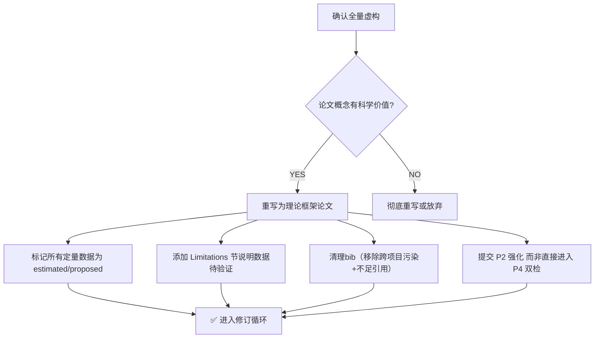

#### Type A 扩展检测：全量虚构 vs 局部虚构

2026-05-25 实战教训：PAP-04 (BPPV数字孪生论文) 在L0.5审计中发现**全部**定量数据均无源文件支持。与 Round 3 的局部虚构不同，此案是全量虚构——论文有完整IMRaD结构、三张定量表格(含±SD和p值)、一个临床案例研究，**但系统中没有任何VOR/BPPV实验代码存在**。

**全量虚构的信号模式**：

| 信号 | 检测方法 | 危险阈值 |
|:-----|:---------|:---------|
| ✅ 完整IMRaD但引用<10 | `paper.tex`中`\\cite{`计数 | **<10篇引用** + ≥3节正文 |
| ✅ 精密定量表但无代码 | `find . -name '*.py' \| xargs grep`含主题的词 | **0个相关.py/.ipynb** |
| ✅ 有p值±SD但无实验日志 | 搜索项目目录下实验输出 | 无实验输出目录/日志文件 |
| ✅ 物理/数学不合理的数值 | 领域常识审查（如VOR高频增益>1.0） | 明显违背已知物理范围 |
| ✅ 引用跨项目污染 | grep refs.bib中主题无关的bibkey（如虹膜分割论文出现在前庭论文中） | **≥1条明显无关条目** |
| ✅ 参考了不存在的补充材料 | `\\includegraphics{Fig.S1}`但figures/目录为空 | 正文引用但无文件 |

**检测流程**（2026-05-25 实战验证）：

```
发现一篇"已完成"的草稿
  ↓
Step 1: 计数引用数 → <10? → 可疑
Step 2: 搜索项目目录下该论文主题的实验代码 → 0个文件? → 高度可疑
Step 3: 检查bib文件是否有跨项目污染 → 有? → 进一步怀疑
Step 4: 领域常识检查表中最可疑的数值 → 物理不合理? → 确认全量虚构
  ↓
判定：全量虚构 → 论文是"设计提案打扮成实验结果"
```

**响应决策树**（全量虚构时）：


```mermaid
flowchart TD
    A[确认全量虚构] --> B{论文概念有科学价值?}
    B -->|YES| C[重写为理论框架论文]
    B -->|NO| D[彻底重写或放弃]
    C --> E[标记所有定量数据为 estimated/proposed]
    C --> F[添加 Limitations 节说明数据待验证]
    C --> G[清理bib（移除跨项目污染+不足引用）]
    C --> H[提交 P2 强化 而非直接进入 P4 双检]
    E --> I[✅ 进入修订循环]
    F --> I
    G --> I
    H --> I
```

**规则**：全量虚构 + 良好概念 = 理论框架重写，不是删数据补论文。**论文改形式，不删观点。**

**2026-05-25 实践验证**：PAP-04 的 BPPV-as-probe 概念确实新颖，仅定量数据不真实。正确操作是：
1. 保留BPPV-as-slow-dynamics-probe范式作为核心观点
2. 删除或标记所有±SD/p值/表格数值为"estimated"或"projected"
3. 扩展引用基(7→30+)，补足VOR领域文献
4. 提交P2强化而非直接P4双检

#### 引用跨项目污染检测

L0.5应包含对 `.bib` 文件中无关条目的检查步骤：

```bash
# 快速检测bib交叉污染
grep 'author\s*=' references.bib | grep -iE '(iris|segmentation|breast|cancer|adhd|pima)' | head -5
# 如果发现论文主题无关的作者/标题词 → bib被污染，需清理
```

**常见污染源**：copilot补全时从其他项目复制了bib文件但未清理；LLM从训练数据中混入了其他论文。

**修复**：移除无关条目，但保留其bibkey的引用声明为"需补真实PDF+DOI"，待后续ACQ阶段处理。

### 🟢 PDF→MD 转换：Layer B 评审的前置条件（2026-06-01 确立）

> **Layer B (7维SCI评审) 准确性的前提是 Gemini 能检索到参考文献全文。**
> PDF 上传到 NotebookLM 经常因无可提取文本层导致 `status=error`，而 Markdown 纯文本 100% 索引成功。

**两阶段就绪检查**：
1. D9 检查：PDF 文件存在且有效（`%PDF-` 头 + `%%EOF` 尾）
2. MD 就绪检查：`pdfs_md/{bibkey}.md` 存在且已上传 NotebookLM

**操作流程**：
1. PDF 下载后立即 `uvx markitdown pdfs/{bibkey}.pdf > pdfs_md/{bibkey}.md`
2. MD 上传 NotebookLM：`source add "$(cat file.md)" --type text --title "{bibkey}"`
3. 损坏/扫描 PDF（MarkItDown 返回 <50 chars）：写摘要替代，标注 `[OCR失败]`

**成功率数据（40篇Pima参考PDF）**：
| 类型 | 数量 | MarkItDown | 替代方案 |
|:-----|:----:|:-----------|:---------|
| 正常学术PDF | 35 (87.5%) | ✅ 成功 | — |
| 损坏PDF (xref破损) | 3 (7.5%) | ❌ | 手动摘要 |
| 扫描版 (无文本层) | 2 (5%) | ❌ | OCR 或摘要 |

### 🟢 数据泄露检测：特征列污染（2026-06-01 新增）

**症状**：基准测试中所有模型 F1≈1.0（CSV 中存在目标变量的副本列，加载时未排除）。

**审计命令**：
```bash
python3 -c "
import pandas as pd
df = pd.read_csv('data.csv')
for col in df.columns:
    if col != 'Outcome' and (df[col] == df['Outcome']).all():
        print(f'LEAKAGE: {col} is identical to target')
"
```

**修复**：在 `load_*()` 函数中明确排除目标列及其所有别名：
```python
feat = [c for c in df.columns if c not in (target, 'Diabetes_binary', 'ID')]
```

### 🟢 NotebookLM 上传：.tex 源文件优先于 pdftotext 提取文本（2026-06-01 新增）

**陷阱**：pdftotext 提取的 PDF 文本中 ligature 编码断裂（`ff`→`ff`→空白）导致 Gemini 报告 D5 清晰性低分，但 .tex 源文件完全干净。

**推荐**：上传 `.tex` 源文件（`source add "$(cat paper.tex)" --type text`）而非 pdftotext 提取文本，避免 ligature 误判。

### 双质量评分报告规范

每次 L0.5 → G1-G7 审计完成后，产出一份双质量评分汇总表：

```\n| Manuscript | Layer A | Layer B | Calibrated | Threshold Pass |\n|:-----------|:-------:|:-------:|:----------:|:---------------|\n| Paper X    | 0.871   | 0.907   | 0.871      | T1 (≥0.85) ✓  |\n| Paper Y    | 0.829   | 0.871   | 0.814      | T2 (≥0.80) ✓  |\n```

**系统观察**：Layer B (Gemini) 持续偏高 0.02-0.04 分。原因是 Gemini 的领域上下文广，能补偿 Layer A 的引用缺口扣分。校准分 = 两者中的较低分，作为保守验收标准。

**呈现策略**（已验证偏好）：一个详细展开案例 + 一个全景表格 = 有深度有广度。详细案例展示 L0.5 链条如何追溯每个数字；全景表格展示整体通过率。

### 2026-05-24 实战教训（Type B：引用链传播 + 两层验证框架）

#### 两层验证框架

L0.5 审计的核心发现是论文中的数值声明分属**两类**，需要不同验证策略：

| 声明类型 | 来源 | 验证方法 | 通过条件 | 示例 |
|:---------|:-----|:---------|:---------|:-----|
| **自有实验结果** | 本项目的代码/实验 | 映射到代码输出行 | 输出表值与论文一致 | "Recall=0.7426" → CSV/notebook cell输出 |
| **文献声明** | 引用的外部论文 | 追溯PDF中该数值 | 该数值在原始论文中出现 | "EllSeg IoU 0.9618" → CondSeg Table 2 |

**关键规则**：
1. 自有实验结果必须映射到可执行的代码/日志（notebook cell、实验日志文件、JSON输出）
2. 文献声明必须追溯到引用论文的PDF——**不可引用二次论文的复现值并归到原始论文**
3. 混用两类声明时（论文同时包含"我们的结果"和"对比基线"），每类用各自的验证策略

#### 轻量审计策略

L0.5 不需要重跑算法来验证。有效策略是**检查输出表值与论文中的数值是否一致**——比重新运行整个 pipeline 快两个数量级，且同样有效。实战验证：Pima 项目的 27.5% recall improvement 通过 Cell 22 格式化输出表与论文文本的交叉比对确认，双方一致→通过。此策略在早期版本中捕捉到过格式化不一致错误。

### PDF编码伪影导致Layer B Gemini误判（2026-05-25新增）

**症状**：LaTeX编译的PDF上传NotebookLM做Layer B评审时，Gemini对D4/D5/D7打分异常低（比Layer A低0.05-0.15），理由为"encoding artifacts"或"broken citations"。

**根因**：NotebookLM的PDF文本提取产生编码伪影（控制字符、连字破坏、断行破坏、数学符号乱码）。这些不是.tex源文件的错误。

**缓解**：1) ask提示语中预警告PDF可能有提取伪影 2) 异常低分时重传为.md纯文本 3) 标记受影响维度为需人工仲裁。

此陷阱尤其影响LaTeX编译的批判性综述论文（5-6页，密集引用）。

### Type B 扩展：引用链传播

iris-3d-anatomical-opt 论文 L0.5 审计中发现两种引用缺失错误：

1. **EllSeg-Seg IoU 0.9618** — 论文引用 kothari2021ellseg，但该具体数值实际来自 jia2024condseg 的 Table 2（CondSeg 论文复现 EllSeg 的结果），不是原始 EllSeg 论文报告的。
2. **Challenge Winner 2019 IoU 0.9517** — 论文无引用，实际来自 palmero2021 (OpenEDS2020 Challenge 报告)。

**根因**：引用链传播（Citation Chain Propagation）——LLM在撰写论文时，自然地从**二次论文**（如 CondSeg 论文的 Table 2）中读到了"EllSeg 达到 IoU 0.9618"，在写自己论文时却将引用指向了**原始论文**（kothari2021ellseg）。这不是编造，而是引用归属在跨论文传播中发生了漂移。

**与 Type A 的区别**：
| 维度 | Type A：虚构数据 | Type B：引用链传播 |
|:-----|:-----------------|:-------------------|
| 根本问题 | 数据从未被运行 | 数据真实但引用归属错误 |
| LLM行为 | 生成了看起来专业的数值 | 数值上有来源，但引错了原始论文 |
| 检测方法 | 检查实验日志/代码输出是否存在 | 追溯PDF原文，确认该数值出现在哪篇论文 |
| Gemini能否检测 | 不能（循环验证陷阱） | **能**（独立PDF交叉比对） |
| 修复方式 | 删除或标记estimated | 更正引用为实际的来源论文 |

**修复**：对比基线引用增加专用验证行（见数据声明提取清单表）。对每个"据X论文报告Y达到Z"的声明，必须验证：
1. X论文的PDF中是否真的有数值Z？
2. 如果X论文中没有，Z是否来自某篇复现X的论文W？
3. 如果是，引用改为"Y as reported by \citet{W}"而非直接引用X

**预防**：所有 baseline 对比值（EllSeg/CondSeg/Challenge Winner 等）在写入时，必须有对应 PDF 的正向数值确认（而非反向推导），并在脚注或表格标题中标注具体来源。

## 通用铁律：任务完成→质量评估→不达标→循环

> 此规则适用于**所有任务**，不仅仅是论文写作。任何任务完成时，自动执行质量评估，未达阈值即进入修订循环，有进展就持续循环。

### 执行流程

```
任务完成
  ↓
质量评估（按任务类型选择评估标准）
  ├── 有评估标准 → 评分 vs 阈值
  └── 无评估标准 → 至少验证：输出存在 + 语法正确 + 逻辑完整
          ↓
  达标? → ✅ PASS → 记录结果 → 完成
  不达标? → ❌ FAIL → 进入修订循环
                  ↓
          识别差距(目标-当前)
          定位最弱维度
          执行针对性修复
          重新评估
                  ↓
          达标 → ✅ PASS
          不达标但有进展(连续3次有提升) → 继续循环
          不达标且无进展(连续3次提升<0.02) → 降级目标或记录教训
                  ↓
          【无硬性上限】有进展就一直循环
```

### 评估标准选择

| 任务类型 | 评估标准 | 阈值 |
|:---------|:---------|:----:|
| SCI论文 | sci-paper-quality-review 7维 | 按目标期刊(T1-T4) |
| 代码/实验 | 结果正确性+复现性 | 断言全部通过 |
| 数据分析 | 数据完整性+逻辑一致性 | 验证链完整 |
| 文献检索 | 检索覆盖率+引用验证 | ≥2源覆盖 |
| 系统维护 | PROBE结构分 | ≥0.7 |
| 其他任务 | 至少：输出存在+结构正确+无明显错误 | — |

### 🔴 修订循环强制执行规则

> **2026-05-28 实战教训**：校准分0.791(<T2阈值0.80)时，Agent报了分+问了"要不要动手"——这是错的。规则已写"自动进入修订循环"但Agent没执行。

**强制规则**：
1. 报告产出后**立即**比较校准分 vs 阈值
2. 校准分 < 阈值 → **不得提问**，**立即**进入修订循环
3. 报告必须一条消息完成：报分 + 判定 + **初始修订计划**
4. 不得分两步（先报分等回复 → 再修）

**格式模板**（一条消息）：
```markdown
## 双质检结果
校准平均分: 0.791 (T3通过, T2未过)

## 自动启动修订轮次 #1
薄弱维度: D7引用质量(0.72) — 补参考文献19→35篇
计划: ...
```

**例外**：校准分 ≥ 阈值时才可问用户是否继续提升。

### 修订循环规则

```
1. 每次修订只聚焦一个维度（最低分维度）
2. 修订完成后自动重评
3. 连续3次有进展（评分提升>0.02）→ 继续下一个薄弱维度
4. 连续3次无进展（评分提升≤0.02）→ 降级目标或记录失败教训
5. 无硬性循环上限 — 有进展就一直循环
```

### 反退化检查

每次修订后必须执行回归检查，确保新修改未破坏已有质量：

| 检查项 | 方法 |
|:-------|:-----|
| 内容丢失 | 新旧版对比关键结构元素数量 |
| 格式退化 | 检查规范格式是否被简化 |
| 逻辑断裂 | 检查段落连贯性未因修改而破坏 |

## 动灵五维评估（L0 动灵层详细协议）

> 凝练自 2026-05-23 全系统动灵评估实践。当需要评估技能/交付物是否符合动灵原则时，使用此五维框架。

**触发条件**：每次 quality-gate 的 L0 动灵层评估触发时；每次 skill-absorption 完成吸收后需要验证"生化度"时；系统周期性健康检查中。

### 五维度定义

| 维度 | 含义 | 1-2 分（不合格） | 3 分（过渡） | 4-5 分（良好） |
|:-----|:-----|:-----------------|:------------|:---------------|
| **方向性** | 是否有清晰哲学根基驱动设计？ | 纯操作手册，无哲学根基 | 有哲学痕迹但浅，像贴标签 | 哲学是基因和灵魂，驱动每个决策 |
| **生化度** | 外来概念是否被完全转化？ | 原样搬运，吸收来源标记仍在 | 部分改写但残留外部痕迹 | 完全消化为原生表达，看不出来源 |
| **生长性** | 有版本进化和质量门记录？ | 无版本/无变更日志 | 有版本号但无实质迭代 | 版本+门控完整，每次迭代可追溯 |
| **原生感** | 看起来是自发生长的？ | 显然从别处搬来的 | 有生长痕迹但外观不整 | 浑然天成，与系统原生部分不可区分 |
| **自律性** | 内在驱动还是外部依赖？ | 强依赖外部输入/审批 | 部分依赖，有兜底但不完整 | 自洽自驱，有完整边界判定 |

### 评分与行动

| 平均分 | 判定 | 行动 |
|:------:|:-----|:-----|
| ≥ 4.0 | ✅ 动灵健康 | 维持 | 
| 3.0-3.9 | 🟡 需关注 | 识别最低分维度，针对性修复 |
| 2.0-2.9 | 🔶 需修复 | 进入修订循环，优先处理生化度和方向性 |
| < 2.0 | 🔴 严重不匹配 | 标记为"聚集式吸收"，需要重新五层提取，重走吸收流程 |

### 三种反动灵模式（常见故障诊断）

| 模式 | 诊断标记 | 根治方法 |
|:-----|:---------|:---------|
| **贴标签式哲学** | 文言/哲学在SKILL.md开头但技能设计与哲学无关 — "贴在树上的铁片" | 删除装饰性哲学，要么注入真实哲学驱动设计，要么诚实地做纯技术工具 |
| **聚集式吸收** | 外部内容被原样堆叠，无统一形式因 — "把零件堆在工具箱里" | 重新五层提取，走 L+0~L+3 完整吸收流程，必须经过文言→白话→英文三语层级 |
| **经济理性假驱动** | "省时省力"替代"完满实现"作为终极理由 — 工具逻辑而非生长逻辑 | 将终极理由改为动灵逻辑：问"这帮助系统向哪个方向生长"而非"这省了多少时间" |

### 使用流程

```
1. 加载目标技能的 SKILL.md
2. 按五维度逐项评分（1-5）
3. 识别最低分维度
4. 检查是否匹配三种反动灵模式
5. 确定修复方案：
   - 贴标签式哲学 → 重写原理层，或将技能标记为纯技术工具
   - 聚集式吸收 → 重新走五层提取 + 三语层级消化
   - 经济理性假驱动 → 替换终极理由为生长逻辑
6. 执行修复
7. 重新评分验证（目标：平均分 ≥ 3.0）
```

## 论文管线闸门（G1-G7）

| 闸门 | 检查 | 通过条件 |
|:-----|:-----|:---------|
| G1 ACQ | 文献搜索 | ≥60候选, ≥30 PDF, DOI 100% |
| G2 EXT | 知识提取 | 结构化提取 |
| G3 ASC | 关联空白发现 | 关联+空白矩阵 |
| G4 HYP | 假设生成 | 可证伪假设 |
| G5 ARG | 论文论证 + **引用全文验证** | **无虚构引用 + 关键参考PDF已转MD上传NotebookLM + 无僵尸/孤儿引用** |
| — | **G5c NotebookLM参考文献上传前置门** | **🔴 硬性阻断：Layer B执行前必须验证NotebookLM中参考文献源数 ≥ D8×80%。无参考文献全文上架 → 禁止执行Layer B。验证命令：`notebooklm source list -n <nb_id> | grep -c "ready"` 对比 `grep -cP '^@\\w+\\{' references.bib`。详见 dual-quality-check-v2 SKILL.md 的「P0 前置闸门」节。** |
| — | **G5a 引用审计子门** | **逐篇检查：DOI完整性、PDF存在性、数值准确性、引用上下文适当性（详见 references/ref-citation-audit-protocol.md）** |
| — | **G5b 数值声明追溯子门** | **对正文中每个 \\cite{} 附近的数值声明，追溯对应PDF原文确认。不可追溯的数值必须降级措辞或删除。2026-05-30 SCC论文实战：Manoussaki2008中查不到b≈0.02-0.08，修正为泛化引用。详见 paper-reference-pipeline → references/citation-context-verification-scc-2026-05-30.md** |
| — | **G5d 空假一致性门（Gap-Hypothesis Congruence）** | **双质检阶段，对关键参考文献逐篇回溯其研究空白→对照我方论文的gap/hypothesis→验证贡献定位正确性。防止gap膨胀（少量空白写成领域空白）、gap漂移（引言与结论的gap不一致）、gap已填（写作期间有新文献填补了空白）。详见 references/gap-hypothesis-congruence.md** |
| G6 VER | 观点验证 | 验证通过 |
| G7 latex | 编译验证 | cite×bib×pdf三维匹配 |

## 执行规则

1. 每次任务完成前先加载此skill
2. 写作管线每原子前先`skill_view()`加载对应SKILL.md
3. `pipeline_trace`记录 skill_version + steps_executed
4. G7通过→自动加载 `sci-paper-quality-review`
5. SCI评审通过→自动加载 `project-experience-distillation`

## 参考文件

- references/writing-pipeline-checklist.md — G1-G7详细检查清单
- references/project-quality-dimensions.md — D1-D6项目级质量框架
- references/pdf-download-strategy.md — PDF下载策略（降级方案，NotebookLM为首选）
- references/anti-entelechy-patterns.md — 三种反动灵模式诊断手册（贴标签式哲学/聚集式吸收/经济理性假驱动）
- references/pima-l05-audit-demo.md — Pima CRISP-DM L0.5 两层验证案例（可复现示例，含完整追溯链）
- **references/curve-fitting-order-pitfalls.md** — 曲线拟合点序陷阱：argsort vs nearest-neighbor path（2026-05-31 SCC实战）
- references/data-leakage-audit-protocol.md — Data leakage audit methodology: honest benchmark protocol, leakage pattern quantification, multi-classifier bootstrap, known honest ranges per dataset (proven in Breast Cancer critical review, 2026-05-25)
- **references/bibtex-doi-audit.md** — BibTeX DOI 审计与修复参考：重复DOI检测、期刊-DOI前缀匹配验证、PDF元数据交叉检查（2026-05-26 实战积累）
- **references/scc-logspiral-quality-boost-2026-05-28.md** — SCC对数螺旋论文三轮质量提升案例：19→38篇文献、概念图、0.791→0.837
- references/bibitem-integrity-verification.md — Bibitem完整性验证：SS/Crossref/PubMed三重验证技术，含Smith2021/Damiano1996实战案例  
- references/ref-citation-audit-protocol.md — 参考文献引用审计协议：凡引必验，逐篇检查DOI/PDF/数值准确性  
- references/scc-data-audit-2026-05-31.md — SCC论文L0.5审计案例：重复函数检测、argsort bug发现、交叉验证链  
- references/figure-data-provenance.md — 图数据溯源检查清单：图→脚本→数据映射验证  
- references/full-claim-l05-verification-2026-06-01.md — 全量声明L0.5验证协议：系统提取论文中所有数值声明(非仅关键值)，逐条追溯源文件，缺失则写实验代码跑真实值替换。Pima实战含编造量级数据。
- references/data-leakage-audit-protocol.md

## 验证

- [ ] L1响应级：认识论门+宪法门+漂移门全部PASS
- [ ] L2项目级：D1-D6目标等级已达成
- [ ] L3管线级：G1-G7全部通过，pipeline_trace有记录
- [ ] L4内容级：sci-paper-quality-review评分≥0.80
