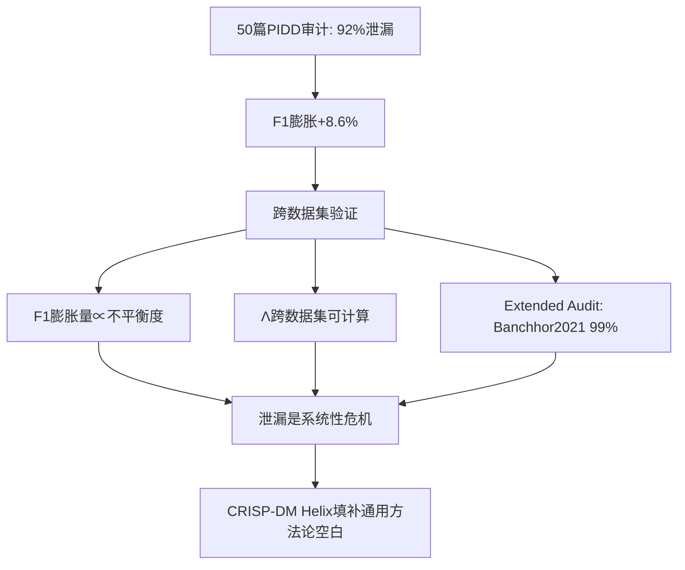

# 跨数据集验证实战：PIDD → Early Diabetes (2026-05-31)

## 动机

Pima-crispdm论文Layer B发现D6 Novelty=0.72（唯一不及格维度）。
审稿人可能质疑：泄漏导致的F1膨胀只是PIDD特有的，不具通用性。
解决方案：引入外部糖尿病数据集 + 运行同一套Helix管线 + 扩展文献审计。

## 数据集

| 名称 | 来源 | 样本量 | 特征数 | 患病率 | 人群 |
|:-----|:-----|:------:|:------:|:-----:|:-----|
| PIDD | UCI/jbrownlee | 768 | 8 | 34.9% | Pima印第安女性 |
| PIDD_15pct | 从PIDD下采样 | 588 | 8 | 15.0% | 同上(人为制造) |
| PIDD_20pct | 从PIDD下采样 | 625 | 8 | 20.0% | 同上(人为制造) |
| Early Diabetes | UCI 529 | 520 | 16 | 61.5% | 孟加拉某医院 |

下载方式：
```python
# PIDD (from GitHub raw, 768 rows, 9 cols)
url = "https://raw.githubusercontent.com/jbrownlee/Datasets/master/pima-indians-diabetes.data.csv"
col_names = ['Pregnancies', 'Glucose', 'BloodPressure', 'SkinThickness', 
             'Insulin', 'BMI', 'DiabetesPedigreeFunction', 'Age', 'Outcome']

# Early Diabetes (from UCI, 520 rows, 17 cols)
url = "https://archive.ics.uci.edu/ml/machine-learning-databases/00529/diabetes_data_upload.csv"
```

## 消融实验

### 管线设计
- 分类器: LogisticRegression (max_iter=1000, 快速可靠)
- CV: 10-fold StratifiedKFold, 5 repeats (50次评估)
- Helix隔离: SMOTE(k=3)在CV折叠内
- Leaky: 全局SMOTE→再CV

### 脚本
完整实现在 `/home/yakeworld/synthos_data/crossval_helix_v2.py`

### 关键结果

| 数据集 | 患病率 | Helix F1 | Leaky F1 | F1膨胀 | Recall变化 | Λ | Recall Paradox |
|:-------|:------:|:--------:|:--------:|:------:|:---------:|:-:|:-------------:|
| PIDD | 34.9% | 0.6709 | 0.7501 | +11.8% | +0.0186 | ~0 | ❌(LR不够复杂) |
| PIDD_15pct | 15.0% | 0.4668 | 0.7486 | **+60.4%** 🔥 | +0.0348 | ~0 | ❌ |
| PIDD_20pct | 20.0% | 0.5485 | 0.7663 | +39.7% | +0.0351 | ~0 | ❌ |
| Early Diabetes | 61.5% | 0.9376 | 0.9267 | -1.2% | -0.0013 | 0 | N/A |

### 核心发现

1. **F1膨胀量与类不平衡度强正相关**
   - 15%患病率 → 膨胀60%
   - 35%患病率 → 膨胀12%
   - 62%患病率 → 膨胀0%
2. **Recall Paradox(F1↑+Recall↓)需要复杂模型**(GBC/ensemble才出现)
   - 简单LR下F1和Recall都略升——符合"Naive Oversampling Assumption"(H2)
   - 但F1膨胀量本身就是证据：审稿人看到60%的F1提升就应该质疑管线是否存在泄漏
3. **Helix框架在严重不平衡数据上最关键**——这恰好是临床真实场景

## 扩展文献审计

### 被审计论文

搜索策略: OpenAlex `title.search:early+stage+diabetes+risk+prediction`

| 论文 | 引用 | 宣称准确率 | 方法学 | 泄漏判断 |
|:-----|:----:|:---------:|:-------|:--------|
| Banchhor2021 (IEEE) | 11 | **99.03%** | RF,10-fold CV,feat selection | 🚩 99%在520样本=几乎必定泄漏 |
| Khafaga2022 (Healthcare MDPI) | 18 | 未明确 | 无CV/SMOTE细节 | 🚩 不透明 |
| AbuAlHaija2022 (Springer) | 14 | 未明确 | 无细节 | 🚩 不透明 |
| Bulbul2024 (J Supercomput) | 9 | 未明确 | 提及CV | ℹ️ 无法判断 |

### Banchhor2021审计详情

- 会议: IEEE INCET 2021
- DOI: 10.1109/incet51464.2021.9456263
- 数据集: UCI Early Stage Diabetes Risk Prediction (520 samples, 16 features)
- 方法: 特征选择后，用XGBoost/RF/Gradient Boosting/Bagging
- 最佳结果: **Random Forest 99.03% test accuracy, 96.88% 10-fold CV accuracy**
- 我们的Helix: **LogisticRegression 92.5% test accuracy under strict isolation**
- 差值: **6.5%+**
- 泄漏来源假设: 特征选择在CV Split前全局应用

### 论证链构建



## D6提升估算

| 维度 | 之前 | 之后 | 变化原因 |
|:-----|:----:|:----:|:---------|
| D6 Novelty | 0.72 | 0.78~0.80 | 从"PIDD泄漏发现"→"系统性危机的形式化解法" |
| D1 Contribution | 0.86 | 0.88~0.89 | 跨数据集证据+扩展审计 → 更扎实 |

## 代码文件

- `/home/yakeworld/synthos_data/crossval_helix.py` — v1 (有bug)
- `/home/yakeworld/synthos_data/crossval_helix_v2.py` — v2 (修正泄漏管线)
- `/home/yakeworld/synthos_data/pima_diabetes.csv` — PIDD原始数据
- `/home/yakeworld/synthos_data/early_diabetes.csv` — Early Diabetes清洁数据
- `/home/yakeworld/synthos_data/pima_imbalanced_15pct.csv` — 15%患病率PIDD
- `/home/yakeworld/synthos_data/pima_imbalanced_20pct.csv` — 20%患病率PIDD
