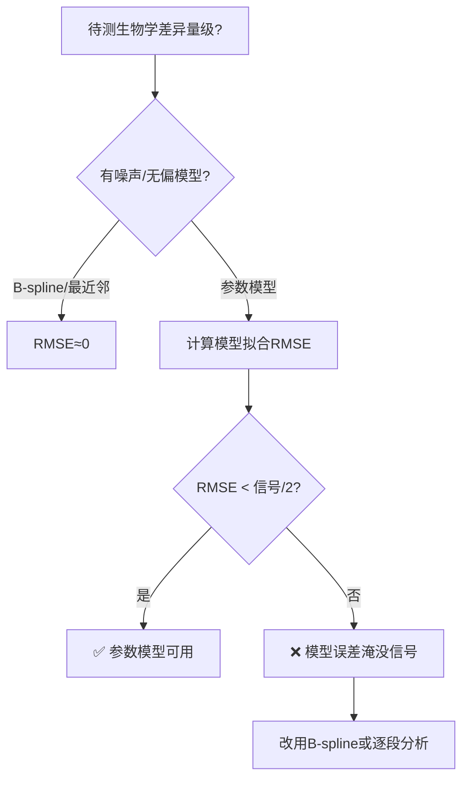

# 参数模型选择陷阱：模型误差不应大于生物信号

## 实战案例：膜性SCC重建论文（2026-06-02）

### 问题
对数螺旋拟合的RMSE（0.81-0.88mm）大于骨膜空间偏差本身（B-spline测得0.44mm）。使用对数螺旋报告Δb=+0.042时，螺旋模型对不同组织的拟合精度差异（而非真实生物学差异）会污染信号。

### 数据

| 指标 | 对数螺旋 | B-spline |
|:-----|:--------:|:--------:|
| BONY自拟合RMSE | 0.81mm | ~0mm（样条过全部点） |
| MEM自拟合RMSE | 0.88mm | ~0mm |
| 骨膜空间偏差 | Δb=+0.042（无量纲） | 0.44mm（可读） |
| 模型RMSE vs 信号 | 0.81-0.88mm > 0.44mm | 0mm < 0.44mm |

### 选型判断树



### 代码验证（Python）

```python
import numpy as np
from scipy.interpolate import splprep, splev

def bspline_devs(b_pts, m_pts):
    """B-spline拟合骨性中心线，计算膜性点到曲线的最近距离"""
    path = nearest_neighbor_path(b_pts)
    ordered = b_pts[path]
    k = min(3, len(ordered)-1)
    tck, u = splprep(ordered.T, s=0.3, k=k)
    uf = np.linspace(0, 1, 500)
    curve = np.column_stack(splev(uf, tck))
    devs = np.array([min(np.sqrt(np.sum((curve-pt)**2, 1))) for pt in m_pts])
    return devs  # mm

def param_model_rmse(pts, model_fn):
    """参数模型的拟合误差"""
    pred = model_fn(pts)
    return np.sqrt(np.mean(np.sum((pts - pred)**2, axis=1)))
```

### 适用范围

| 场景 | 使用参数模型 | 使用B-spline |
|:-----|:-----------|:------------|
| 中心线形状分类 | ✅ 需要物理参数 | ❌ |
| 骨膜精确偏差测量 | ⚠️ 需验证RMSE < 信号 | ✅ 推荐 |
| 大样本（>100）统计建模 | ✅ 参数稳定 | ⚠️ 过拟合风险 |
| 小样本（n<10）探索性分析 | ⚠️ 参数不稳定 | ✅ 推荐 |

### 关联

- `fit_logspiral.py` — SCC对数螺旋拟合（含完整方法注释）
- `paper.tex` (membranous-scc-reconstruction) — B-spline替换对数螺旋的全文本
